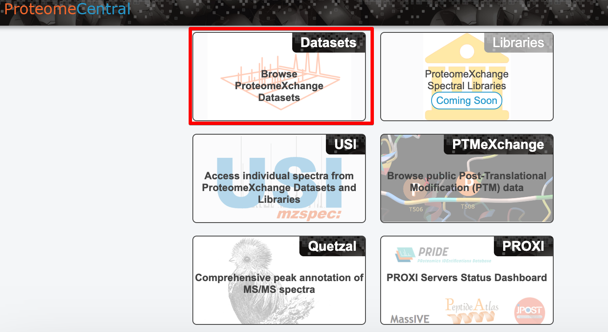
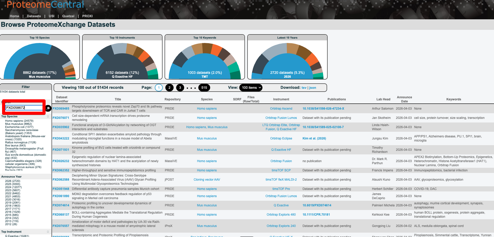
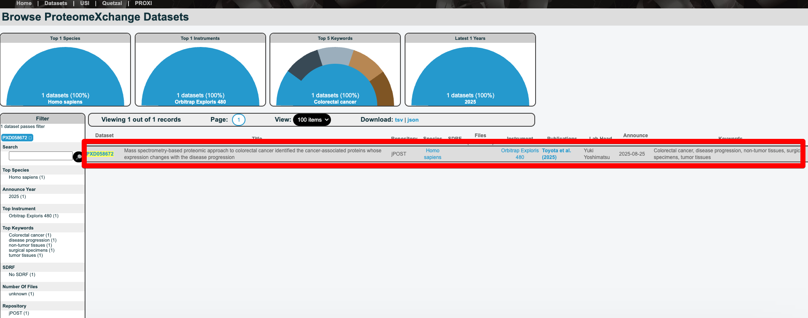
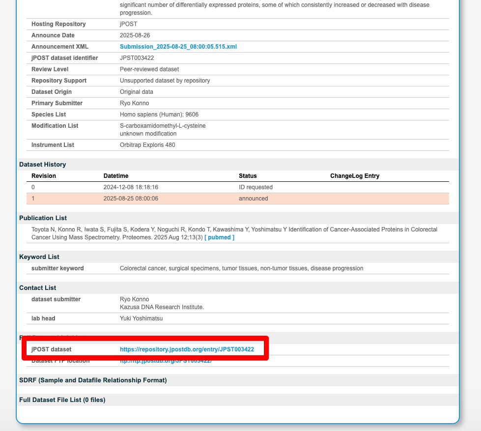
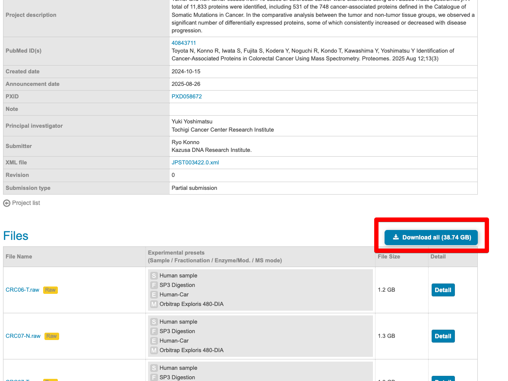

# ProteomeXchangeから大腸がんプロテオミクスデータを取得する

## はじめに

この記事では、Toyota et al. 2025 の公開データをProteomeXchangeからダウンロードします。プロテオミクス論文のデータは通常、ProteomeXchangeコンソーシアムを通じて公開されており、誰でも無料でアクセスできます。

## ProteomeXchangeとは

ProteomeXchange（https://www.proteomexchange.org）は、質量分析ベースのプロテオミクスデータを共有する国際コンソーシアムです。論文で使用されたRAWデータや解析結果がここに登録されています。

本論文のデータは以下に登録されています：

| リポジトリ | ID | 内容 |
|----------|-----|------|
| ProteomeXchange | **PXD058672** | RAWファイル, mzML |
| jPOST | **JPST003422** | DIA解析出力, 定量データ |

---

## DIA-MSとは？

本論文のRAWファイルは **DIA（Data-Independent Acquisition）** モードで測定されたデータです。データをダウンロードする前に、DIA-MSの基本を押さえておきましょう。

### DDA vs DIA

質量分析によるプロテオミクスでは、主に2つの取得モードが使われます：

| | DDA（Data-Dependent Acquisition） | DIA（Data-Independent Acquisition） |
|---|---|---|
| **選択方法** | MS1スキャンで強度の高いイオンを選択してMS2を取得 | あらかじめ決めたm/z範囲を**網羅的に**スキャン |
| **再現性** | 測定ごとに選択されるイオンが異なる → **再現性が低い** | 全イオンを取得 → **再現性が高い** |
| **データ複雑性** | MS2スペクトルが1ペプチドに対応 → 解析が比較的シンプル | MS2スペクトルが複数ペプチド由来の混合 → **専用ソフトウェアが必要** |
| **定量性** | Missing valueが多い | Missing valueが少なく**定量精度が高い** |
| **主な用途** | 探索的な同定、ライブラリ構築 | 大規模コホートの定量比較 |

本論文では、16患者 × 2条件の比較を高い再現性で行うために **DIAモード** が採用されています。

### Orbitrap Exploris 480

本データの測定に使用された **Orbitrap Exploris 480**（Thermo Fisher Scientific）は、高分解能・高感度のOrbitrap型質量分析計です。DIAモードとの組み合わせにより、1回の測定で数千タンパク質を安定して定量できます。

### 解析パイプラインへの影響

DIAデータはスペクトルが複雑なため、従来のDDA用サーチエンジン（Mascot, MaxQuantのAndromeda等）ではなく、**DIA専用の解析ツール**が必要です。本シリーズでは、MITライセンスの**sage-proteomics**を使ってmzMLデータからタンパク質を同定・定量します。

---

## ブラウザでGUIからダウンロードする

ブラウザからGUI操作でデータをダウンロードする方法です。

### Step 2-1: ProteomeXchangeでデータセットを検索する

ProteomeCentral（https://proteomecentral.proteomexchange.org）にアクセスし、トップページの **「Datasets」** をクリックします。



Datasetsページに移動したら、左側の **Filter** 欄にデータセットID `PXD058672` を入力して検索します。



検索結果に該当するデータセット（PXD058672）が1件表示されます。**Toyota et al. (2025)** の論文であることを確認し、赤枠で囲まれたデータセット行をクリックして詳細ページに移動します。



データセットの詳細ページが表示されたら、ページ下部の **「jPOST dataset」** のリンクをクリックして、jPOSTリポジトリに移動します。

https://repository.jpostdb.org/entry/JPST003422



### Step 2-2: jPOSTリポジトリのデータセット概要を確認する

本論文のデータは **jPOSTrepo**（ProteomeXchangeのパートナーリポジトリ）にホストされています。データセット概要ページ（下図）で以下の情報を確認できます：

- **Project title**: 論文のタイトル
- **Keywords**: colorectal cancer, surgical specimens, tumor tissues 等
- **Dataset ID**: JPST003422
- **Publication(s)**: 論文のDOIとリンク


> **ポイント:** ページ下部の **"Files"** セクションに、ダウンロード可能なファイル一覧があります。

### Step 2-3: 「Download all」でデータをダウンロードする

ページ下部の **"Files"** セクションにある **「Download all」** ボタン（青色、約38.74 GB）をクリックして、全データを一括ダウンロードします。



> **注意:** 全ファイルで約40GBあるため、ダウンロードには時間がかかります。安定したネットワーク環境での実行を推奨します。
>
> **補足:** 本シリーズではRAWデータをさらに処理したmzMLファイルを用いて解析を行います。そのため、mzMLファイルのみのダウンロードでも問題ありません。jPOSTの "Files" セクションからmzMLファイルだけを選択してダウンロードすれば、容量を大幅に節約できます。

---

## RAWデータの構成

jPOSTからダウンロードしたファイルは以下の通りです：

| ファイル名パターン | 形式 | 内容 |
|----------------|------|------|
| `CRC01-N.raw` | RAW | 患者1の**正常組織**のDIA-MSデータ |
| `CRC01-T.raw` | RAW | 患者1の**腫瘍組織**のDIA-MSデータ |
| `CRC02-N.raw` 〜 `CRC16-T.raw` | RAW | 患者2〜16の正常/腫瘍組織 |

- 全16患者 × 2条件（Normal/Tumor）= **32ファイル**
- 各ファイル約1〜2GB、合計約40GB
- 本シリーズでは、sage-proteomicsを使ってmzMLからタンパク質を同定・定量します

> **補足:** 本シリーズでは全16患者分（CRC01-CRC16）の32ファイルを使用して解析を行います。RAWファイルからmzMLへの変換手順については、[#3 RAW→mzML変換](article-03-convert.md)を参照してください。

### 実験プリセット情報

jPOSTの各ファイルには以下の実験条件が記録されています：

| タグ | 項目 | 値 | 意味 |
|:---:|------|-----|------|
| **S** | Sample | Human sample | ヒト由来サンプル |
| **F** | Fractionation | SP3 Digestion | SP3法（磁気ビーズ）でタンパク質を消化 |
| **E** | Enzyme/Mod. | Human-Car | ヒトプロテオーム + カルバミドメチル化（Cys修飾） |
| **M** | MS mode | Orbitrap Exploris 480-DIA | Orbitrap Exploris 480でDIAモード測定 |

### ファイル形式: RAW と mzML

ダウンロードしたファイルの中身を実際に覗いてみましょう。

#### .raw ファイル（Thermo独自バイナリ）

`.raw` はThermo Fisher Scientific独自のバイナリ形式です。ファイルの先頭をhexダンプすると、以下のような構造が見えます：

```
00000000: 01a1 4600 6900 6e00 6e00 6900 6700 6100  ..F.i.n.n.i.g.a.
00000010: 6e00 ...                                   n.
00000030: 5800 6300 6100 6c00 6900 6200 7500 7200  X.c.a.l.i.b.u.r.
00000040: 5f00 5300 7900 7300 7400 6500 6d00 ...   _.S.y.s.t.e.m.
00000060: 0000 5400 6800 6500 7200 6d00 6f00 ...   ..T.h.e.r.m.o.
```

- **`Finnigan`** — Thermo RAW形式のマジックバイト（ファイル識別子）
- **`Xcalibur_System`** — 測定制御ソフトウェア名
- **`Thermo`** — メーカー名

これ以降のスキャンデータや機器パラメータはすべてバイナリでエンコードされており、人間が直接読むことはできません。解析に使うには、**ProteoWizard（msconvert）** などのツールでmzMLに変換する必要があります。

#### .mzML ファイル（オープンXML形式）

`.mzML` はRAWファイルをProteoWizardで変換したオープンフォーマットです。XML形式なので、テキストエディタでも内容を確認できます。

**メタデータ部分の例（CRC04-T.mzML）：**

```xml
<referenceableParamGroup id="CommonInstrumentParams">
  <cvParam name="Orbitrap Exploris 480" />
  <cvParam name="instrument serial number" value="MA10127C" />
</referenceableParamGroup>

<software id="Xcalibur" version="3.1-3.1.231.6/3.1.279.9" />
<software id="pwiz" version="3.0.21257" />

<run id="CRC04-T" startTimeStamp="2022-12-22T10:33:42Z">
  <spectrumList count="51701">
```

このヘッダから以下の情報が読み取れます：

| 項目 | 値 |
|------|-----|
| 装置 | Orbitrap Exploris 480（シリアル: MA10127C） |
| イオン源 | nanoelectrospray |
| 分析部 | quadrupole → orbitrap |
| 制御ソフト | Xcalibur 3.1 |
| 変換ソフト | ProteoWizard 3.0.21257 |
| 測定日時 | 2022-12-22 10:33:42 UTC |
| 総スキャン数 | **51,701スキャン** |

**スペクトルデータ部分の例（スキャン1）：**

```xml
<spectrum index="0" id="controllerType=0 controllerNumber=1 scan=1">
  <cvParam name="MS1 spectrum" />
  <cvParam name="ms level" value="1" />
  <cvParam name="positive scan" />
  <cvParam name="centroid spectrum" />
  <cvParam name="base peak m/z" value="548.2862601" />
  <cvParam name="total ion current" value="1.96729888e08" />
  <cvParam name="filter string"
           value="FTMS + c NSI Full ms [495.0000-865.0000]" />
```

各スキャンには **m/z配列** と **intensity配列** が64-bit float + zlib圧縮 + Base64エンコードで格納されています。sageなどの解析ツールがこれをデコードしてペプチド同定に使います。

#### 2形式の比較

| | .raw | .mzML |
|---|---|---|
| **形式** | Thermo独自バイナリ | オープンXML |
| **可読性** | ツールがないと読めない | テキストエディタで確認可能 |
| **ファイルサイズ** | 約1.3 GB | 約0.9 GB（圧縮効率による） |
| **DIA解析ツールへの入力** | ツールによっては直接読み込み可能 | 直接読み込み可能 |
| **汎用性** | Thermo製ツール限定 | あらゆる解析ツールで利用可能 |

> **ポイント:** mzML形式であればsage・OpenMSなど主要な解析ツールで読み込めるため、**本シリーズではmzMLを使用します**。本データセット（JPST003422）にはmzMLファイルが併載されていますが、ProteomeXchangeでは**RAWファイルのみ公開されているケースが大半**です。その場合のRAW → mzML変換方法については、[次章（#3 RAW→mzML変換）](article-03-convert.md)で詳しく解説します。

---

## まとめ

ProteomeXchange / jPOST からDIA-MSのRAWデータとmzMLファイルをダウンロードしました。RAWファイルしかない場合のmzML変換については次章で解説します。

この手順は**他の論文のDIA-MSデータ**にもそのまま適用できます。ProteomeXchangeにデータが公開されている論文であれば、データセットIDを変えるだけで同じ流れでデータを取得できます。

> 前回: [#1 環境構築](article-01-setup.md)
> 次回: [#3 RAW→mzML変換](article-03-convert.md) — Thermo RAWファイルをmzMLに変換する

#バイオインフォマティクス #プロテオミクス #ProteomeXchange #labcode
