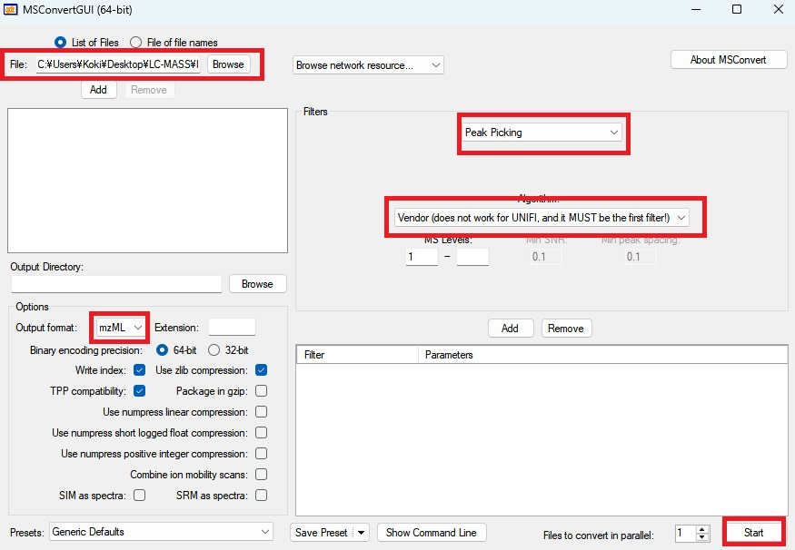
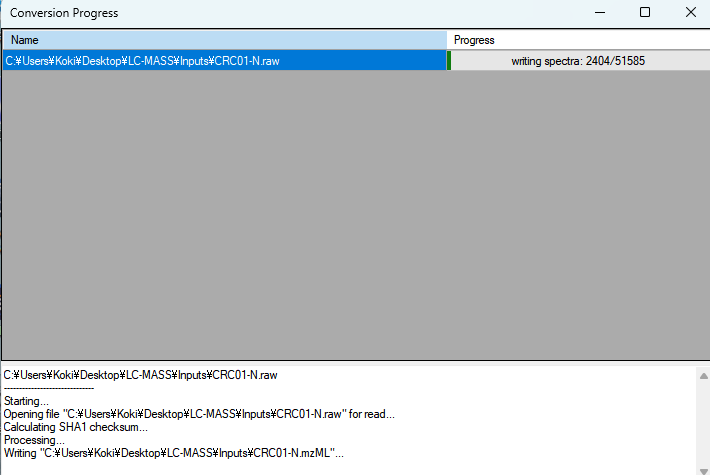

# ProteoWizardでThermo RAWをmzMLに変換する

## はじめに

この記事では、実際のデータファイル **CRC01-N.raw**（大腸がん患者の正常組織）を使って、**ProteoWizard** によるRAW→mzML変換を実践します。

Toyota et al. 2025の論文では、Thermo Orbitrap Exploris 480で取得されたRAWファイルを解析していますが、これらの独自バイナリ形式を汎用のmzMLに変換する必要があります。

## 今回変換するファイル

```bash
📁 /home/shizuku/labcode/article/Proteomics_drug_marker/Inputs/
└── CRC01-N.raw (1.07 GB) ← 今回変換するファイル
```

**CRC01-N.raw の詳細:**
- **患者**: CRC01（大腸がん患者1番）
- **組織**: N（Normal、正常組織）
- **装置**: Thermo Orbitrap Exploris 480
- **測定法**: DIA-MS（Data-Independent Acquisition）

## なぜmzMLに変換するのか

**Thermo独自のRAWファイル**は以下の問題があります：

1. **独自バイナリ形式**: Thermoでしか読み込めない
2. **解析ツールの制限**: sage、MaxQuant、OpenMSなどは直接読み込み不可
3. **OS依存**: Windows専用ライブラリが必要

**mzMLは国際標準のオープンフォーマット**で：

- どの解析ツールでも読み込み可能
- OS非依存（Windows/Linux/macOS）
- 長期保存に適している（10年後も確実に読める）

---

## ProteoWizardとは

**ProteoWizard** は、質量分析データの変換・処理を行うオープンソースツール群です。

- **開発**: Vanderbilt大学 + Pacific Northwest National Laboratory
- **ライセンス**: Apache 2.0（商用利用可能）
- **msconvert**: RAW→mzML変換の事実上の標準ツール
- **対応形式**: Thermo、Bruker、SCIEX、Waters、Agilentなど全メーカー

## 前提条件

- **Windows PC**（推奨）または Windows仮想マシン
- **CRC01-N.raw** が手元にあること（1.07GB）

> **注意**: macOS Apple Siliconでは制約があります（記事末尾で説明）

---

## ProteoWizardのインストール

### Step 1: ダウンロードとインストール

1. [ProteoWizard 公式サイト](https://proteowizard.sourceforge.io/) にアクセス
2. **Download** → **Windows** から最新版をダウンロード
   ```
   pwiz-setup-3.0.XXXX-x86_64.msi (約500MB)
   ```
3. MSIファイルを実行してインストール

**インストール先について**:
- **記載上**: `C:\Program Files\ProteoWizard`
- **実際のデフォルト**: `C:\Users\[ユーザー名]\AppData\Local\Apps\ProteoWizard 3.0.XXXX...`

> **重要**: 最近のバージョンでは、管理者権限を必要としない **AppDataフォルダ** がデフォルトのインストール先になっています。このため、多くの解説サイトで示されている `Program Files` とは異なる場所にインストールされます。

### Step 2: インストール場所の確認と検索方法

**現在のProteoWizardは、デフォルトでAppDataフォルダにインストール**されます：

```cmd
# 最も可能性が高い場所（現在のデフォルト）
dir "C:\Users\%USERNAME%\AppData\Local\Apps\ProteoWizard*"

# 従来の場所（古いバージョンや手動指定した場合）
dir "C:\Program Files\ProteoWizard\"
dir "C:\Program Files (x86)\ProteoWizard\"
```

#### ProteoWizardが見つからない場合の検索方法

**1. コマンドプロンプトでシステム全体検索**
```cmd
# Cドライブ全体からmsconvert.exeを検索（時間がかかります）
dir /s C:\*msconvert.exe*

# より高速：特定のディレクトリから検索
dir /s "C:\Users\%USERNAME%\*msconvert.exe*"
dir /s "C:\Program Files\*msconvert.exe*"
```

**2. PowerShellでの高速検索**
```powershell
# PowerShellを開いて実行（より高速）
Get-ChildItem -Path C:\ -Name "msconvert.exe" -Recurse -ErrorAction SilentlyContinue

# ProteoWizardフォルダを検索
Get-ChildItem -Path C:\ -Name "*ProteoWizard*" -Recurse -ErrorAction SilentlyContinue
```

**3. Windowsの検索機能を使用**
- **Windowsキー** を押してスタートメニューを開く
- **msconvert** または **ProteoWizard** で検索
- 見つかったアプリを右クリック → **ファイルの場所を開く**

**4. エクスプローラーでの検索**
- **エクスプローラー** を開く
- **Cドライブ** を選択
- 検索ボックスに **msconvert.exe** と入力
- 検索結果からパスを確認

**5. whereコマンド（PATHが通っている場合のみ）**
```cmd
# パスが通っていれば場所を表示
where msconvert.exe
```

**典型的なインストール先**:
```
C:\Users\Koki\AppData\Local\Apps\ProteoWizard 3.0.26095.be91649 64-bit\
```

> **検索のコツ**: AppDataフォルダは隠しフォルダのため、エクスプローラーで手動で探す場合は、**表示** → **隠しファイル** を有効にしてください。

> **なぜAppDataなのか**: 管理者権限を不要とし、ユーザー個別のインストールを可能にするため、最近のバージョンではAppDataフォルダがデフォルトになっています。

### Step 3: 環境変数PATHに追加

毎回長いパスを入力するのを避けるため、PATHに追加します：

#### 方法1: GUIで追加（推奨）

1. **環境変数設定画面を開く**
   ```cmd
   # 直接開く場合
   rundll32 sysdm.cpl,EditEnvironmentVariables
   ```
   または **Windowsキー + R** → `sysdm.cpl` → **詳細設定** → **環境変数**

2. **ユーザー環境変数の編集**
   - **ユーザー環境変数** セクションで **Path** を選択
   - **編集** をクリック
   - **新規** をクリック
   - 以下のパスを追加：
     ```
     C:\Users\Koki\AppData\Local\Apps\ProteoWizard 3.0.26095.be91649 64-bit
     ```
   - **OK** → **OK** → **OK** で保存

> **なぜGUIが推奨なのか**: コマンド（setx）にはPATH長の制限（1024文字）があり、既存のPATHが長い場合に新しいパスが切り捨てられてしまいます。GUIではこの制限がありません。

#### 方法2: PowerShellで追加（コマンド派向け）
```powershell
# PowerShellを管理者として実行
$oldPath = [Environment]::GetEnvironmentVariable("Path", "User")
$newPath = $oldPath + ";C:\Users\Koki\AppData\Local\Apps\ProteoWizard 3.0.26095.be91649 64-bit"
[Environment]::SetEnvironmentVariable("Path", $newPath, "User")
```

> **注意**: `setx PATH "%PATH%;..."`は文字数制限で失敗することが多いため推奨しません。

### Step 4: 動作確認

**重要**: コマンドプロンプトを再起動してから実行

```cmd
# 新しいコマンドプロンプトを開いて確認
msconvert --help
```

**成功時の出力例**：
```
Usage: msconvert [options] [filemasks]
Convert mass spec data file formats.

Return value: # of failed files.

Options:
  -f [ --filelist ] arg              : specify text file containing filenames
  -o [ --outdir ] arg (=.)           : set output directory ('-' for stdout, '.' for current directory) [.]
  -c [ --config ] arg                : configuration file (optionName=value)
  --outfile arg                      : Override the name of output file.
  -e [ --ext ] arg                   : set extension for output files [mzML|mzXML|mgf|txt|mz5|mzMLb]
  --mzML                             : write mzML format [default]
  --mzXML                            : write mzXML format
  --mz5                              : write mz5 format
  --mzMLb                            : write mzMLb format
  --mzMLbChunkSize arg (=1048576)    : mzMLb dataset chunk size in bytes
  --mzMLbCompressionLevel arg (=4)   : mzMLb GZIP compression level (0-9)
  --mgf                              : write Mascot generic format
  --text                             : write ProteoWizard internal text format
  --ms1                              : write MS1 format
  --cms1                             : write CMS1 format
  --ms2                              : write MS2 format
  --cms2                             : write CMS2 format
  ...
```

✅ **このようなヘルプ画面が表示されれば、ProteoWizardの設定は完了です！**

**確認ポイント**：
- `msconvert` コマンドが認識されている
- 各種出力フォーマット（mzML、mzXML、mgf等）が利用可能
- `--mzML` がデフォルト形式として設定されている

**エラーが出る場合**：
```cmd
'msconvert' は、内部コマンドまたは外部コマンド、
操作可能なプログラムまたはバッチ ファイルとして認識されていません。
```
→ PATH設定を再確認し、コマンドプロンプトを再起動してください

## rawファイルの変換

PATHが通ったので、簡単なコマンドで変換できます：

```cmd
# RAWファイルがあるディレクトリに移動
cd /d D:\proteomics_data\Inputs\

# CRC01-N.rawをmzMLに変換（PATHが通っているため短縮可能）
msconvert CRC01-N.raw --mzML --filter "peakPicking vendor msLevel=1-" -o .
```

**パスが通っていない場合は**、フルパスで実行：
```cmd
"C:\Users\Koki\AppData\Local\Apps\ProteoWizard 3.0.26095.be91649 64-bit\msconvert.exe" CRC01-N.raw --mzML --filter "peakPicking vendor msLevel=1-" -o .
```

### コマンドの詳細解説

```cmd
msconvert CRC01-N.raw --mzML --filter "peakPicking vendor msLevel=1-" -o .
```

| 部分 | 説明 |
|------|------|
| `CRC01-N.raw` | 入力ファイル（1.07GB） |
| `--mzML` | 出力形式をmzMLに指定 |
| `--filter "peakPicking vendor msLevel=1-"` | Thermoの標準アルゴリズムでピーク検出（MS1+MS2レベル） |
| `-o .` | 現在のディレクトリに出力 |

### 実行前の最終確認

変換を実行する前に、必要なファイルがあることを確認：

```cmd
# RAWファイルの存在確認
dir CRC01-N.raw

# 出力先の空き容量確認（約1.5GB必要）
dir
```

### 複数ファイルの一括変換

**複数のRAWファイルがある場合**の一括変換方法：

#### コマンドライン版：ワイルドカード使用
```cmd
# 同一フォルダ内の全RAWファイルを一括変換
msconvert *.raw --mzML --filter "peakPicking vendor msLevel=1-" -o .

# 特定パターンのファイルのみ変換（例：CRCで始まるファイル）
msconvert CRC*.raw --mzML --filter "peakPicking vendor msLevel=1-" -o .

# 変換結果確認
dir *.mzML
```

**例：5つのRAWファイルを一括変換**
```cmd
# 変換前の確認
dir *.raw
CRC01-N.raw    (1.07 GB)
CRC01-T.raw    (1.15 GB)
CRC02-N.raw    (1.02 GB)
CRC02-T.raw    (1.08 GB)
CRC03-N.raw    (1.11 GB)

# 一括変換実行
msconvert *.raw --mzML --filter "peakPicking vendor msLevel=1-" -o .

# 変換後の確認
dir *.mzML
CRC01-N.mzML   (1.2 GB)
CRC01-T.mzML   (1.3 GB)
CRC02-N.mzML   (1.1 GB)
CRC02-T.mzML   (1.2 GB)
CRC03-N.mzML   (1.2 GB)
```

### 変換の実行と結果

変換には5-10分程度かかります：

```
Processing: CRC01-N.raw
Writing: CRC01-N.mzML
conversion completed: CRC01-N.mzML (1.2GB)
```

**変換結果:**
```
📁 Inputs/
├── CRC01-N.raw     (1.07 GB) ← 元ファイル
└── CRC01-N.mzML    (1.2 GB)  ← 変換後ファイル
```

### GUI版での変換（コマンドライン苦手な方向け）

**MSConvertGUI**を使った変換手順を詳しく解説します。スタートメニューから **MSConvert** を起動してください。



**① ファイル選択（左上赤枠）**：

**単一ファイルの場合**：
1. **File:** フィールドの **Browse** ボタンをクリック
2. CRC01-N.rawファイルがある場所を選択
3. **CRC01-N.raw** を選択して **開く** をクリック
4. **🚨重要🚨 Add ボタンを押すことを忘れずに！**

**複数ファイルの場合**：
1. **Browse** ボタンをクリック
2. **Ctrl** キーを押しながら複数のRAWファイルを選択
   - CRC01-N.raw
   - CRC01-T.raw
   - CRC02-N.raw
   - ...
3. **開く** をクリック
4. **Add** ボタンをクリック
5. 左側のリストに全ファイルが表示されることを確認

> **注意**: ファイルを選択しただけでは変換リストに追加されません。必ず **Add** ボタンをクリックして、左側の変換ファイルリストにすべてのRAWファイルが表示されることを確認してください。

**② 出力形式の設定（左下赤枠）**：
- **Output format:** が **mzML** になっていることを確認
- デフォルトでmzMLが選択されているはずです

**③ Peak Picking設定（中央赤枠）**：
1. **Filters** セクションで **Peak Picking** が選択されていることを確認
2. **Vendor (does not work for UNIFI, and it MUST be the first filter!)** が表示されていることを確認

> **重要**: "Vendor (does not work for UNIFI, and it MUST be the first filter!)" の表示は正常です。これはThermoの標準アルゴリズムでピーク検出を行うという意味です。

**④ 変換実行（右下赤枠）**：
- すべての設定が完了したら **Start** ボタンをクリック

#### 変換の実行と確認

**変換中の表示**：
- **Start** ボタンクリック後、変換が開始されます
- **Conversion Progress** ウィンドウが表示されます
- 進行状況がプログレスバーで表示されます
- **CRC01-N.raw (1.07GB)** の変換には **5-10分程度** かかります



**変換プロセス**：
1. **Starting...** - 変換準備開始
2. **Opening file** - RAWファイルを読み込み中
3. **Calculating SHA1 checksum...** - ファイル整合性確認
4. **Processing...** - データ処理中
5. **Writing spectra: 2404/51585** - スペクトラム書き込み進行状況
6. **Writing mzML** - mzMLファイル生成中

**変換完了後**：

**単一ファイルの場合**：
- **51,585スペクトラム** の処理が完了
- **CRC01-N.mzML (約1.2GB)** が同じフォルダに生成されます

```
📁 出力結果（単一ファイル）
├── CRC01-N.raw     (1.07 GB) ← 元ファイル
└── CRC01-N.mzML    (1.2 GB)  ← 変換後ファイル
```

**複数ファイルの場合**：
- 各ファイルが順次処理されます
- すべての変換が完了するとウィンドウが閉じます

```
📁 出力結果（複数ファイル）
├── CRC01-N.raw     (1.07 GB) ← 元ファイル
├── CRC01-N.mzML    (1.2 GB)  ← 変換後ファイル
├── CRC01-T.raw     (1.15 GB) ← 元ファイル
├── CRC01-T.mzML    (1.3 GB)  ← 変換後ファイル
├── CRC02-N.raw     (1.02 GB) ← 元ファイル
└── CRC02-N.mzML    (1.1 GB)  ← 変換後ファイル
```

> **スペクトラム数の確認**: 進行画面の "writing spectra: 2404/51585" から、このDIA-MSデータには **51,585個のスペクトラム** が含まれていることがわかります。これは典型的なDIA測定のスペクトラム数です。

> **一括変換の利点**: 複数ファイルの場合、設定を一度行うだけで全ファイルに同じ処理が適用されるため、一貫性のある変換結果が得られます。

> **GUI版のメリット**: コマンドラインが苦手でも直感的に設定でき、設定ミスを防げます。特に **Peak Picking** の **Vendor** 設定が視覚的に確認できるのが利点です。

## DIA-MSデータの特徴確認

変換されたmzMLファイルの中身を確認してみましょう：

```xml
<!-- CRC01-N.mzMLの一部 -->
<mzML>
  <cvList>...</cvList>
  <fileDescription>
    <fileContent>
      <cvParam name="DIA" />  <!-- ← DIA測定であることを確認 -->
    </fileContent>
  </fileDescription>
  <run id="CRC01-N">
    <spectrumList count="XXXX">  <!-- スペクトラム数 -->
```

**確認ポイント:**
- **DIA**: Data-Independent Acquisitionで測定されていること
- **スペクトラム数**: 通常数万〜数十万スペクトラム
- **ファイルサイズ**: RAWとほぼ同等（圧縮効果により若干増減）

---

## まとめ

**CRC01-N.raw** をProteoWizardで **CRC01-N.mzML** に変換しました。

### 変換前後の比較
```
変換前: CRC01-N.raw  (1.07 GB) - Thermo独自形式
変換後: CRC01-N.mzML (1.2 GB)  - 標準オープン形式
```

### 次のステップ

この mzML ファイルは sage-proteomics でタンパク質同定・定量に使用できます。Toyota et al. 2025 の再現解析において、このファイルから**約2,000個のタンパク質**を同定できる予定です。


> **前回**: [#2 データ取得](article-02-data.md)
> **次回**: [#4 sageで同定・定量](article-04-sage.md) — sage-proteomicsによるタンパク質同定・定量

#バイオインフォマティクス #プロテオミクス #ProteoWizard #msconvert #labcode
