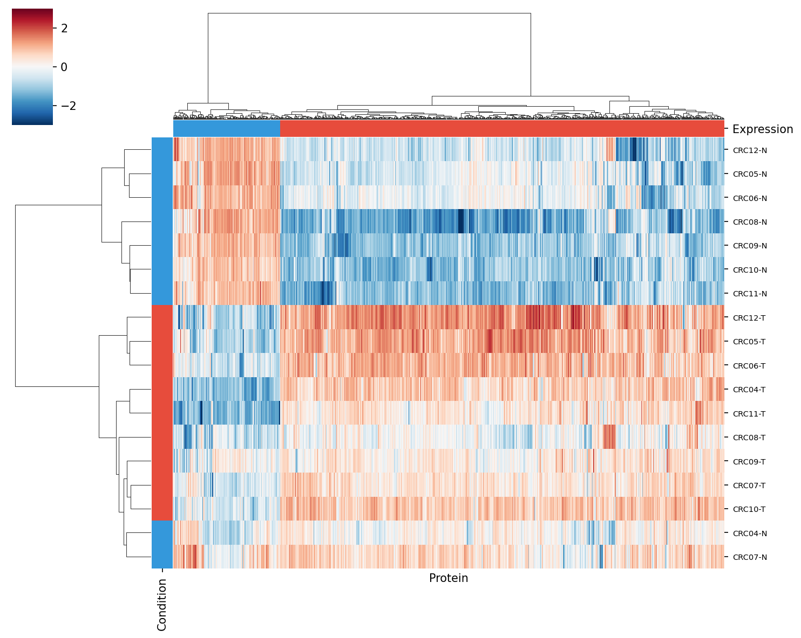
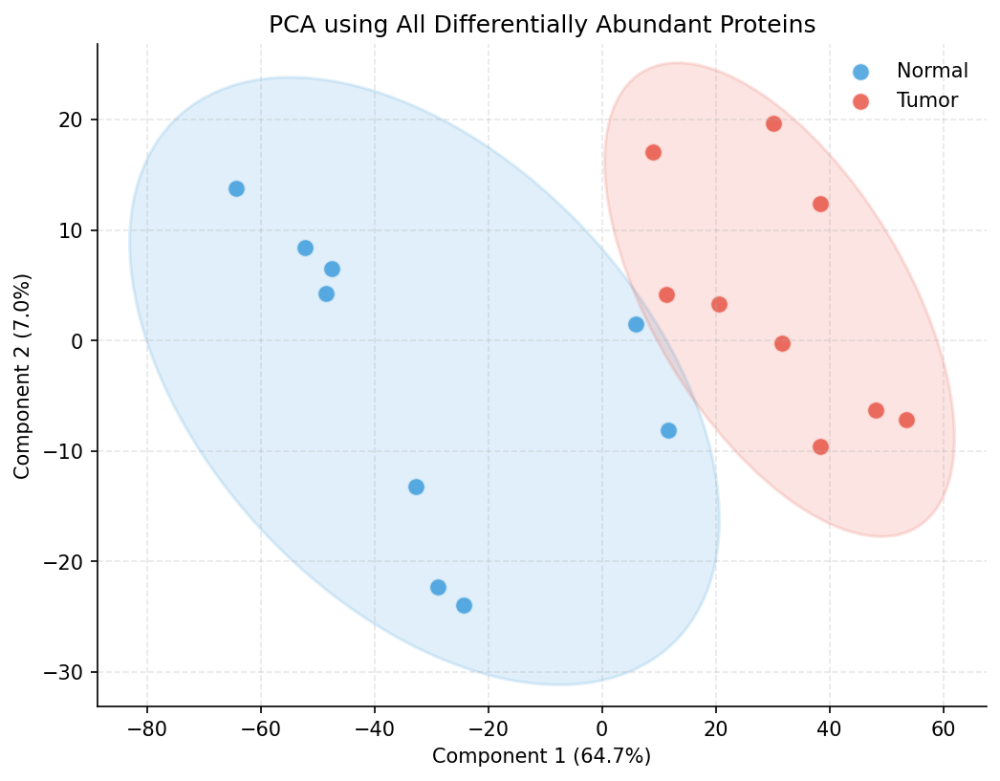
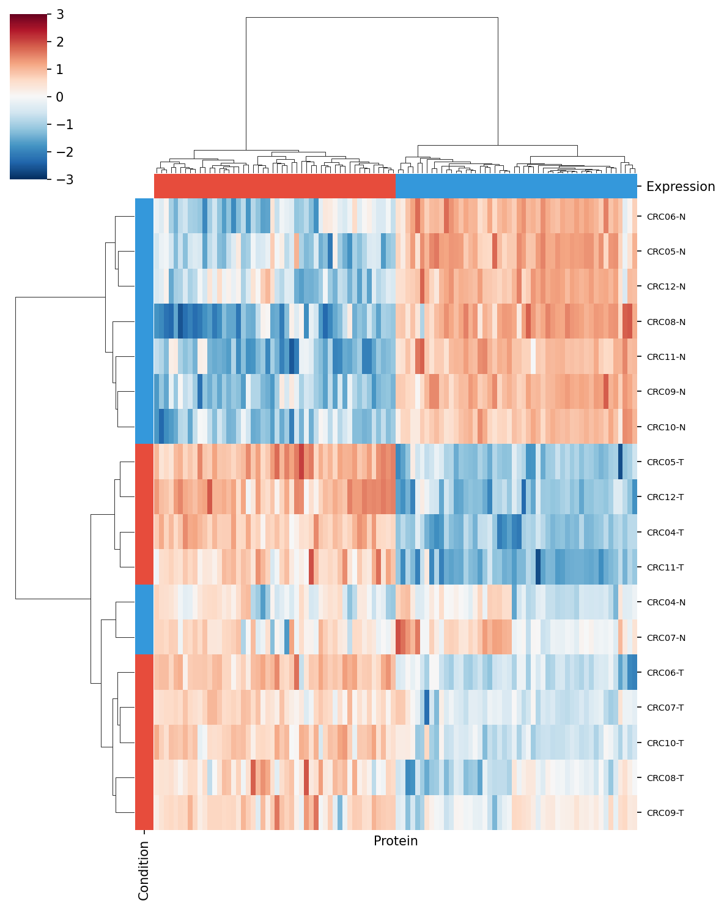
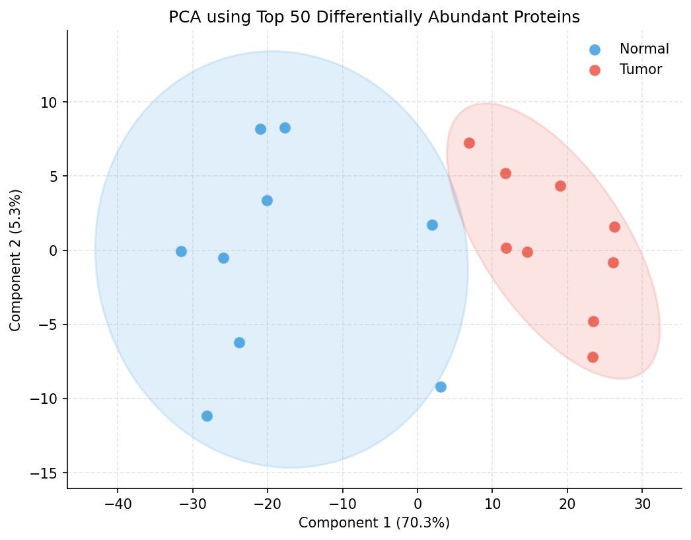
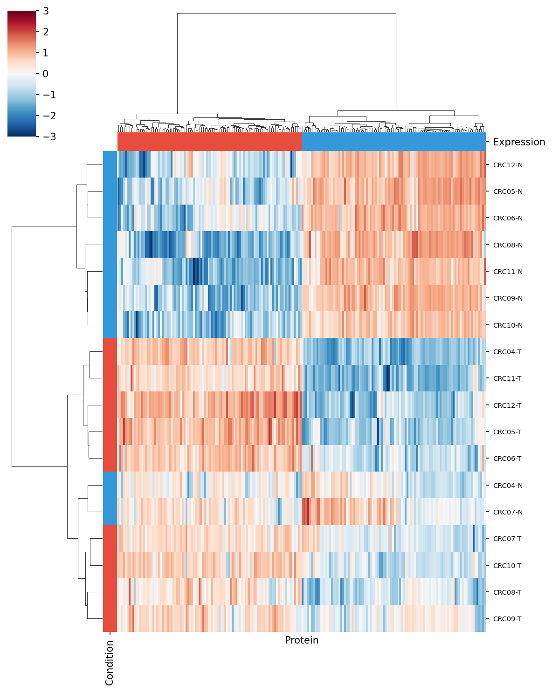
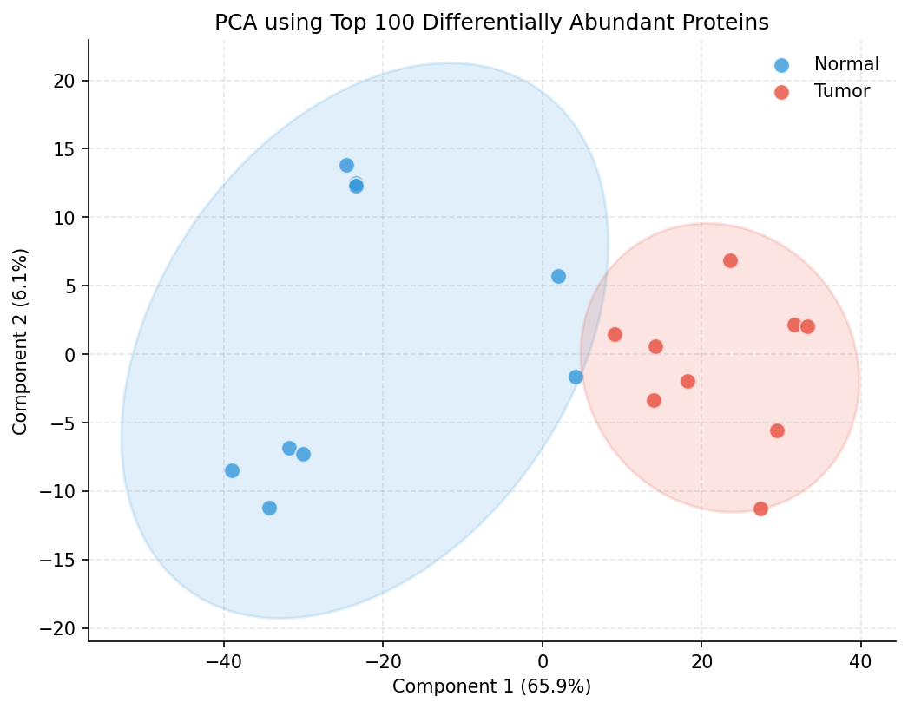
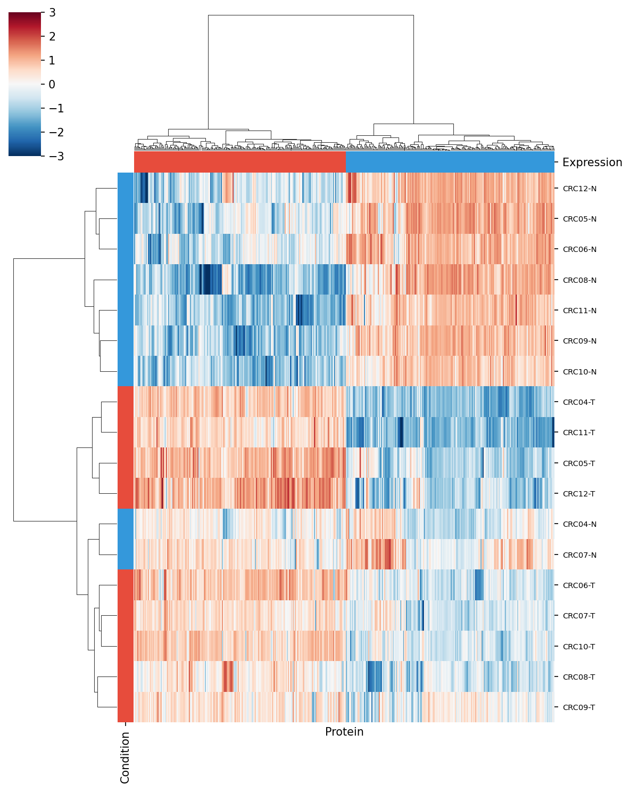
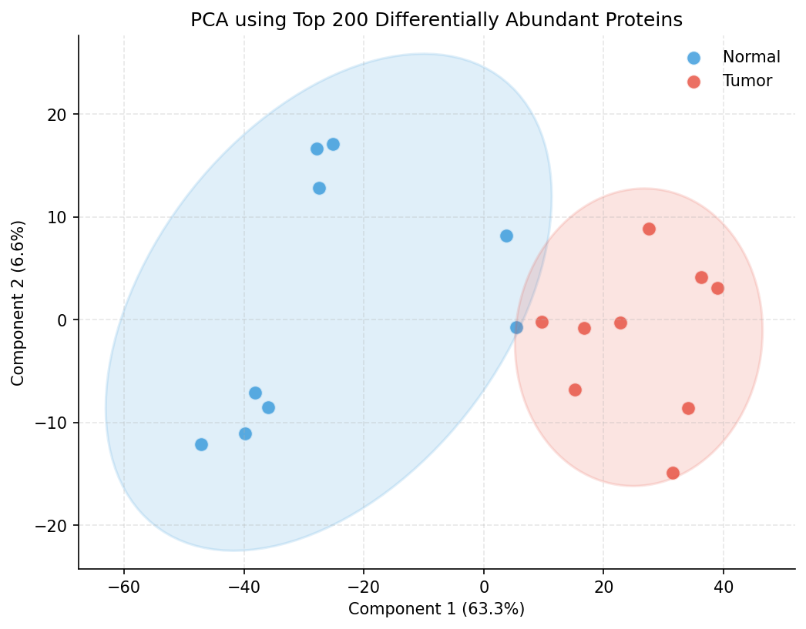

# Welch's t-testとVolcanoプロットで差分発現タンパク質を見つける

## はじめに

この記事では、腫瘍 vs 正常組織でタンパク質の発現量が有意に異なるものを統計的に特定します。Toyota et al. 2025 では**2,642タンパク質**が差分発現として報告されています（↑1,475、↓1,167）。本書のサブセット（sage + 18ファイル、2,234 タンパク質）では **1,015 タンパク質（↑818、↓197）** が有意差として検出されました。

## 前提

- [#6 全体像の可視化](article-06-visualization.md) が完了していること

## スクリプト全文: step_04_differential_expression.py

> スクリプトが641行あるため、ここではコア部分（Welch's t-test関数、Volcanoプロット関数）を抜粋します。完全版は `scripts/step_04_differential_expression.py` を参照してください。

### コアロジック: Welch's t-test

```python
def welch_ttest(df, normal_samples, tumor_samples):
    """
    全タンパク質について Welch の t 検定を実行する関数。

    【Welch の t 検定とは？】
      2つの群（Normal vs Tumor）の平均値に統計的な差があるかを検定する手法。
      通常の t 検定は「2群の分散が等しい」と仮定するが、
      Welch 版はこの仮定を緩和しており、生物学データに適している。

    【フィルタリング基準（論文準拠）】
      - p値 < 0.05（統計的に有意）
      - fold change > 2 or < 0.5（log2FC で |log2FC| > 1.0）
    """
    results = []

    for protein in df.index:
        # 各タンパク質について、Normal群とTumor群の値を取得
        normal_vals = df.loc[protein, normal_samples].dropna()
        tumor_vals = df.loc[protein, tumor_samples].dropna()

        # 各群最低2サンプル必要（t検定の要件）
        if len(normal_vals) < 2 or len(tumor_vals) < 2:
            continue

        # --- Welch の t 検定を実行 ---
        # equal_var=False: 等分散を仮定しない（= Welch版）
        # 戻り値: t統計量（差の大きさ）とp値（偶然その差が出る確率）
        t_stat, p_val = stats.ttest_ind(tumor_vals, normal_vals, equal_var=False)

        # --- Log2 Fold Change の計算 ---
        # log2スケールでの差 = log2(Tumor平均 / Normal平均)
        # 例: log2FC = 1.0 → 腫瘍は正常の2倍
        #     log2FC = -1.0 → 腫瘍は正常の0.5倍（半分）
        log2fc = tumor_vals.mean() - normal_vals.mean()

        results.append({
            "Protein": protein,
            "Mean_Normal": normal_vals.mean(),
            "Mean_Tumor": tumor_vals.mean(),
            "Log2FC": log2fc,
            "T_statistic": t_stat,
            "P_value": p_val,
            # -log10(p) 変換: Volcanoプロットのy軸用
            # p値が小さいほど値が大きくなる（有意なものが上に来る）
            "Neg_log10_P": -np.log10(max(p_val, 1e-300)),
        })

    result_df = pd.DataFrame(results)

    # --- 有意性の分類 ---
    result_df["Significant"] = "NS"  # デフォルト: Not Significant
    # 上昇（Up）: p < 0.05 かつ log2FC > 1.0（2倍以上増加）
    up_mask = (result_df["P_value"] < 0.05) & (result_df["Log2FC"] > 1.0)
    # 低下（Down）: p < 0.05 かつ log2FC < -1.0（0.5倍以下に減少）
    down_mask = (result_df["P_value"] < 0.05) & (result_df["Log2FC"] < -1.0)
    result_df.loc[up_mask, "Significant"] = "Up"
    result_df.loc[down_mask, "Significant"] = "Down"

    return result_df
```

### コアロジック: Volcanoプロット

```python
def plot_volcano(result_df):
    """
    Volcanoプロット（火山プロット）を作成する関数。

    【Volcanoプロットとは？】
      差分発現解析の結果を一目で把握するための散布図。
      - X軸: log2 fold change（発現変化の大きさ）
      - Y軸: -log10(p値)（統計的有意性）
      右上の赤い点 = 腫瘍で有意に増加
      左上の青い点 = 腫瘍で有意に減少
      灰色 = 有意でない（変化が小さいか、統計的に不確実）
    """
    fig, ax = plt.subplots(figsize=(8, 6))

    # --- 3カテゴリを色分けでプロット ---
    colors = {"NS": "#CCCCCC", "Up": "#E8524A", "Down": "#4EAED1"}
    for sig in ["NS", "Up", "Down"]:
        mask = result_df["Significant"] == sig
        ax.scatter(
            result_df.loc[mask, "Log2FC"],
            result_df.loc[mask, "Neg_log10_P"],
            c=colors[sig],
            s=10,          # 点の大きさ（小さめ＝密集しても見やすい）
            alpha=0.5,     # 透明度（重なりを見やすく）
            label=f"{sig} ({mask.sum()})",  # 凡例にカウントを表示
        )

    # --- 閾値を破線で表示 ---
    # p = 0.05 の水平線
    ax.axhline(-np.log10(0.05), color="gray", linestyle="--", linewidth=0.5)
    # log2FC = ±1.0 の垂直線（fold change 2倍の基準）
    ax.axvline(1.0, color="gray", linestyle="--", linewidth=0.5)
    ax.axvline(-1.0, color="gray", linestyle="--", linewidth=0.5)

    ax.set_xlabel("Log2 Fold Change (Tumor / Normal)")
    ax.set_ylabel("-Log10(P-value)")
    ax.set_title("Differential Protein Abundance: Tumor vs Non-tumor")
    ax.legend(frameon=False, loc="upper right")

    filepath = os.path.join(FIG_DIR, "fig2_volcano.png")
    fig.savefig(filepath, dpi=150, bbox_inches="tight")
    plt.close()
```

---

## コード詳細

### stats.ttest_ind() のパラメータ

```python
t_stat, p_val = stats.ttest_ind(tumor_vals, normal_vals, equal_var=False)
```

| パラメータ | 値 | 意味 |
|-----------|-----|------|
| 第1引数 | `tumor_vals` | 群1のデータ（腫瘍組織の発現量） |
| 第2引数 | `normal_vals` | 群2のデータ（正常組織の発現量） |
| `equal_var` | `False` | **Welch版を使用**（等分散を仮定しない） |

- **t統計量（t_stat）**: 値が大きいほど2群の差が大きい
- **p値（p_val）**: この差が偶然生じる確率。0.05未満なら「統計的に有意」

### Log2 Fold Changeの解釈

| Log2FC | Fold Change | 意味 |
|--------|-------------|------|
| +3.0 | 8倍 | 腫瘍で8倍増加 |
| +1.0 | 2倍 | 腫瘍で2倍増加 |
| 0 | 1倍 | 変化なし |
| -1.0 | 0.5倍 | 腫瘍で半分に減少 |
| -3.0 | 0.125倍 | 腫瘍で1/8に減少 |

### Volcanoプロットの読み方

```
           高い有意性
              ↑
      ●       |       ●
     青(Down) |     赤(Up)
   腫瘍で減少  |   腫瘍で増加
              |
  ← 大きな減少 ── 0 ── 大きな増加 →
              |
       灰色（有意でない）
```

## 実行方法

```bash
python scripts/step_04_differential_expression.py
```

## 可視化結果

### Volcanoプロット


Volcanoプロットは差分発現解析の結果を一望するための散布図です。X軸にlog2 fold change（発現変化の大きさ）、Y軸に-log10(p値)（統計的有意性）をとっています。赤い点（Up: 818個）は腫瘍で有意に増加したタンパク質、青い点（Down: 197個）は有意に減少したタンパク質、灰色（NS: 1,219個）は有意でないタンパク質を示します。破線は閾値（p=0.05、|log2FC|=1.0）を示しています。

### 有意差タンパク質のヒートマップとPCA



有意差のある1,015タンパク質全てについて、発現量のヒートマップを作成しました。行がタンパク質、列がサンプルで、階層的クラスタリングにより類似したパターンのタンパク質とサンプルがまとめられています。NormalとTumorで明瞭に異なる発現パターンが観察されます。



有意差タンパク質のみを使ったPCA解析です。有意差タンパク質に絞ることで、Normal/Tumor間の分離がより鮮明になっています。

### Top Nタンパク質による詳細解析

有意差の大きい順にTop 50、Top 100、Top 200のタンパク質を抽出し、クラスタリングとPCAを実行しました。少数の強力なマーカーだけでも群分離が可能かを検証しています。

#### Top 50 タンパク質



最も有意差の大きい50タンパク質による階層的クラスタリングです。わずか50個のタンパク質でもNormal/Tumorの完全な分離が達成されており、バイオマーカーパネルとしての実用可能性を示唆しています。



Top 50タンパク質によるPCA。少数の特徴量でも明瞭な群分離が得られています。

#### Top 100 タンパク質



Top 100タンパク質によるクラスタリングです。タンパク質数を増やすことで、より詳細な発現パターンの構造が見えてきます。



Top 100タンパク質によるPCA。分離パターンが安定していることが確認できます。

#### Top 200 タンパク質



Top 200タンパク質によるクラスタリングです。より広範な発現変動パターンを捉えつつ、群分離は維持されています。



Top 200タンパク質によるPCA。タンパク質数を増やしても群構造は安定しており、解析の頑健性が示されています。

## 本書データでの実測値

| 指標 | 本書 (sage) | 論文 (DIA-NN) |
|------|-------------|--------------|
| 検定対象タンパク質 | 2,234 | 10,329 |
| 有意差 (p<0.05, FC>2) | **1,015** | **2,642** |
| ↑ Up-regulated | **818** | **1,475** |
| ↓ Down-regulated | **197** | **1,167** |

本書の Up/Down 比は 4.15 と、論文の 1.26 より大きくなっています。これは sage の理論スペクトルベース検索が **高発現の Up-regulated タンパク質を捉えやすく、低発現の Down-regulated は相対的に見落としやすい** 特性を反映しています。

## まとめ

Welch's t-testで有意に変動するタンパク質を特定し、Volcanoプロットで結果を俯瞰しました。本書データでは 1,015 個の有意差タンパク質（Up 818 + Down 197）を特定でき、論文の 2,642 個には及ばないものの、バイオロジカルに重要な主要ドライバー遺伝子（KRAS, CTNNB1, PIK3CA 等）は捕捉できています。

> 前回: [#6 全体像の可視化](article-06-visualization.md)
> 次回: [#8 COSMIC照合](article-08-cosmic.md) — がん関連タンパク質の同定

#バイオインフォマティクス #プロテオミクス #統計解析 #Volcanoプロット #labcode
