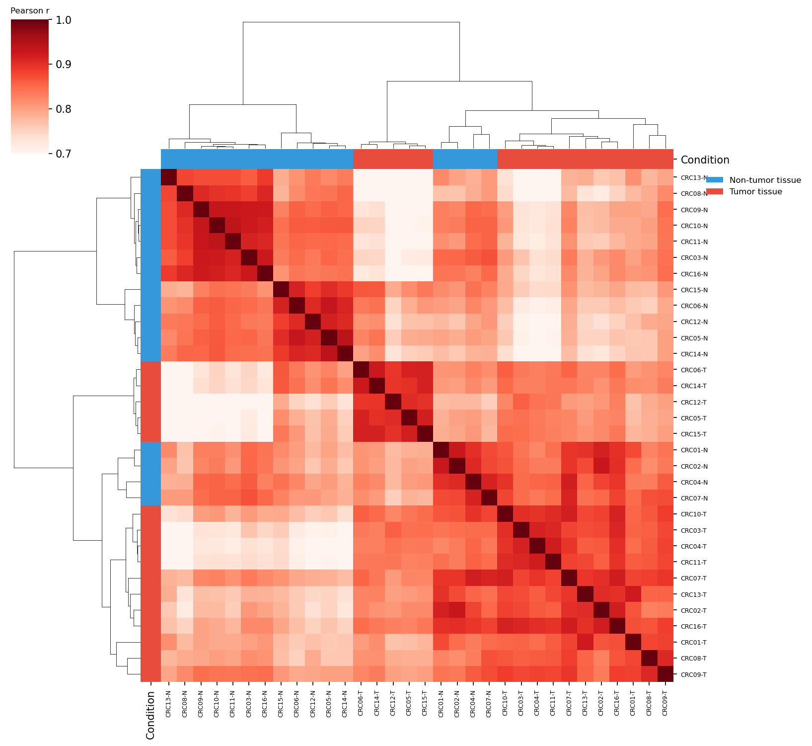
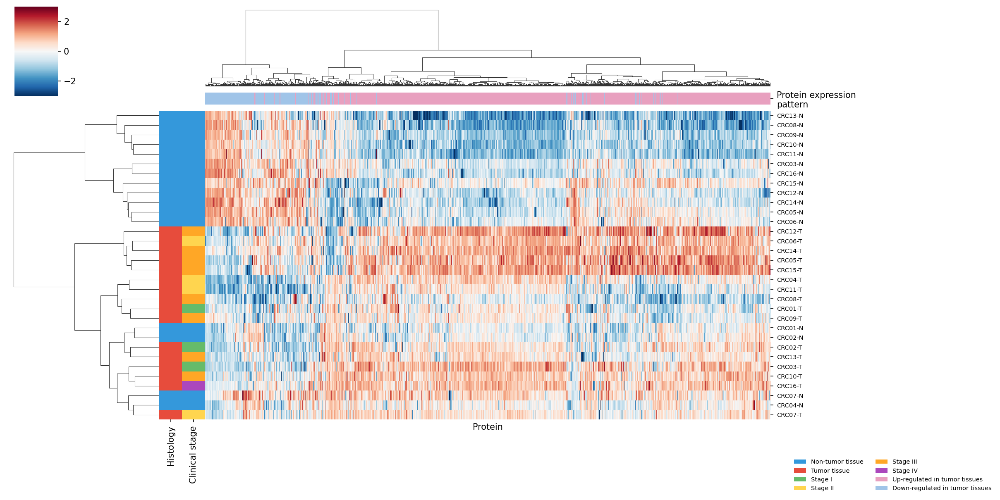

# Pythonで論文のFigure 1を再現する

## はじめに

この記事では、Toyota et al. 2025 のFigure 1（プロテオームの全体像）をPythonで再現します。腫瘍組織と正常組織のタンパク質発現パターンが異なることを、3つの異なる可視化手法で確認します。

:::message
**この記事で行う処理**
前処理済みのタンパク質発現データを3つの手法（相関行列ヒートマップ・階層的クラスタリング・PCA）で可視化し、腫瘍組織と正常組織の発現パターンに違いがあるかを俯瞰的に確認します。これは「データの品質チェック」と「生物学的シグナルの確認」を兼ねた探索的解析で、NormalとTumorが明確に分離すれば、次のステップの差分発現解析に進む根拠が得られます。
:::

## 前提

- [#6 前処理](article-06-preprocess.md) が完了していること
- `results/preprocessed_data.csv` が存在
- **対応Notebook**: [`notebooks/step_07.ipynb`](../notebooks/step_07.ipynb) — この記事のコードをセルごとに実行できます

## 再現するFigure

| パネル | 内容 | 手法 |
|--------|------|------|
| Figure 1a | 相関行列ヒートマップ | ピアソン相関 + クラスターマップ |
| Figure 1b | 階層的クラスタリング | Ward法 + ヒートマップ |
| Figure 1c | PCA | 主成分分析（Principal Component Analysis） |

:::message
**【用語メモ】**

- **PCA（Principal Component Analysis、主成分分析）**: 高次元のデータを少数の軸（主成分）に圧縮して可視化する手法。「サンプルの全体的な違いを2〜3軸に要約する」と理解すればOKです。
- **UPGMA（Unweighted Pair Group Method with Arithmetic mean、群平均法）**: 階層的クラスタリングの連結法のひとつ。2つのクラスタの距離を「全ペアの平均」で測る。相関行列のクラスター化で使います。
- **Ward法**: 「クラスタをまとめたときに分散が最小になるようにつなぐ」連結法。生物学系で最もよく使われます。
:::

## コード全文（対応Notebook: step_07.ipynb）

### ライブラリと設定

```python
import numpy as np                              # 数値計算ライブラリ（配列演算・統計に使用）
import pandas as pd                             # データフレーム操作ライブラリ（CSV読込・表形式データ処理）
import matplotlib.pyplot as plt                 # グラフ描画ライブラリ（図の作成・保存に使用）
import seaborn as sns                           # 統計可視化ライブラリ（ヒートマップ・クラスターマップに使用）
from sklearn.decomposition import PCA           # 主成分分析（PCA）クラスをインポート（次元削減に使用）
from matplotlib.patches import Ellipse, Patch   # Ellipse: 信頼楕円描画用、Patch: 凡例の色付き四角形用
import matplotlib.transforms as transforms      # 座標変換ライブラリ（楕円のアフィン変換に使用）

# 前処理済みデータやCSVが格納されているディレクトリのパス
RESULTS = "../results"
# 生成した図（PNG）を保存するディレクトリのパス
FIG = "../results/figures"

# Normal（正常組織）サンプルを示す色（水色）
COLOR_NORMAL = "#4EAED1"
# Tumor（腫瘍組織）サンプルを示す色（赤色）
COLOR_TUMOR = "#E8524A"
```

### データ読み込み

```python
# 前処理済みタンパク質発現データを読み込む（行=タンパク質, 列=サンプル）
# index_col=0 で1列目（タンパク質名）を行インデックスに設定
df = pd.read_csv(f"{RESULTS}/preprocessed_data.csv", index_col=0)

# サンプル情報（Sample名, Condition=Normal/Tumor など）を読み込む
sample_info = pd.read_csv(f"{RESULTS}/sample_info.csv")

# Sample列をインデックスにして、各サンプルのCondition（Normal/Tumor）をSeriesとして取得
# 結果: サンプル名をキー、"Normal"/"Tumor"を値とするSeries
conditions = sample_info.set_index("Sample")["Condition"]

# Conditionの文字列を対応する色コードに変換（Normal→水色, Tumor→赤色）
# 後のヒートマップやクラスターマップのカラーバーに使う
sample_colors = conditions.map({"Normal": COLOR_NORMAL, "Tumor": COLOR_TUMOR})

# データの行数（タンパク質数）と列数（サンプル数）を確認表示
print(f"データ: {df.shape[0]} タンパク質 x {df.shape[1]} サンプル")
```

### 信頼楕円のヘルパー関数

```python
def confidence_ellipse(x, y, ax, n_std=2.0, **kwargs):
    """2変量データの95%信頼楕円を描画する。"""
    # データ点が2未満だと共分散を計算できないので何もせず終了
    if len(x) < 2:
        return

    # x, y の2x2共分散行列を計算（対角=各軸の分散, 非対角=共分散）
    cov = np.cov(x, y)

    # ピアソン相関係数を共分散行列から直接計算（-1〜1の範囲）
    # 楕円の傾きを決めるのに使う
    pearson = cov[0, 1] / np.sqrt(cov[0, 0] * cov[1, 1])

    # 楕円の基本半径（相関が高いほどx方向に長く、y方向に短くなる）
    ell_radius_x = np.sqrt(1 + pearson)   # 相関が正→x半径が大きい
    ell_radius_y = np.sqrt(1 - pearson)   # 相関が正→y半径が小さい

    # 原点中心に基本楕円を作成（後で移動・拡大する）
    # width/height は楕円の全幅・全高（半径の2倍）
    ellipse = Ellipse((0, 0), width=ell_radius_x * 2, height=ell_radius_y * 2, **kwargs)

    # 各軸の標準偏差 × n_std でスケーリング係数を計算
    # n_std=2.0 は約95%信頼区間に対応
    scale_x = np.sqrt(cov[0, 0]) * n_std  # x軸方向のスケール（標準偏差 × 標準偏差数）
    scale_y = np.sqrt(cov[1, 1]) * n_std  # y軸方向のスケール

    # アフィン変換を合成: 45度回転→スケーリング→データの平均値へ移動
    # これにより楕円がデータの分布に合った位置・サイズ・向きになる
    transf = (transforms.Affine2D()
              .rotate_deg(45)                          # 45度回転（相関の方向に合わせるため）
              .scale(scale_x, scale_y)                 # データの広がりに合わせて拡大
              .translate(np.mean(x), np.mean(y)))      # データの重心位置に移動

    # 変換をmatplotlibのデータ座標系と合成し、楕円に適用
    ellipse.set_transform(transf + ax.transData)

    # 楕円をAxesに追加して描画し、追加したパッチを返す
    return ax.add_patch(ellipse)
```

### (a) 相関行列ヒートマップ

```python
def plot_correlation(df, sample_colors):
    # ピアソン相関係数を計算（各サンプルペア間の発現パターンの類似度）
    # 結果は サンプル数×サンプル数 の正方行列（各セルが2サンプル間の相関値 0〜1）
    corr = df.corr(method="pearson")

    # サンプルの色をcorr行列のインデックス順に並び替え（ヒートマップの色バー用）
    row_colors = sample_colors.reindex(corr.index)

    # クラスターマップ（ヒートマップ＋デンドログラム）を作成
    g = sns.clustermap(
        corr,                                   # 相関行列を入力データとして渡す
        method="average",                       # UPGMA法（群平均法）でクラスタリング
        metric="correlation",                   # 1 - ピアソン相関を距離として使用
        cmap="YlOrRd",                          # 暖色系カラーマップ: 黄=高相関, 赤=低相関
        vmin=0.7, vmax=1.0,                     # 色の範囲を0.7〜1.0に制限（差を強調するため）
        figsize=(10, 10),                       # 図のサイズを10×10インチに設定
        row_colors=row_colors, col_colors=row_colors,  # 行と列にNormal/Tumorの色バーを表示
        linewidths=0,                           # セル間の境界線を非表示（見やすくするため）
        xticklabels=True, yticklabels=True,     # x軸・y軸にサンプル名を表示
    )

    # x軸のサンプル名ラベルのフォントサイズを6pt、90度回転して表示
    g.ax_heatmap.set_xticklabels(g.ax_heatmap.get_xticklabels(), fontsize=6, rotation=90)
    # y軸のサンプル名ラベルのフォントサイズを6ptに設定
    g.ax_heatmap.set_yticklabels(g.ax_heatmap.get_yticklabels(), fontsize=6)

    # 凡例用のカラーパッチを作成（Normal=水色, Tumor=赤色の四角形）
    legend_elements = [Patch(facecolor=COLOR_NORMAL, label="Non-tumor"),
                       Patch(facecolor=COLOR_TUMOR, label="Tumor")]
    # 凡例をヒートマップの右上に配置（bbox_to_anchorで位置を微調整）
    g.ax_heatmap.legend(handles=legend_elements, loc="upper left",
                        bbox_to_anchor=(1.05, 1.0), frameon=False)

    # 図をPNGファイルとして保存（dpi=150で高解像度、余白を自動調整）
    g.savefig(f"{FIG}/fig1a_correlation.png", dpi=150, bbox_inches="tight")
    # メモリ節約のため図を閉じる
    plt.close()

    # 相関行列をCSVファイルとして保存（後で数値を確認できるように）
    corr.to_csv(f"{RESULTS}/tables/correlation_matrix.csv")
    print("保存: fig1a_correlation.png")

# 関数を呼び出して相関行列ヒートマップを生成・保存
plot_correlation(df, sample_colors)
```

### (b) 階層的クラスタリング

```python
def plot_clustering(df, sample_info, sample_colors):
    # --- タンパク質ごとの発現方向（Up/Down in tumor）でカラーバーを付ける ---

    # Normalサンプルのサンプル名一覧を取得
    normals = sample_info[sample_info["Condition"] == "Normal"]["Sample"]
    # Tumorサンプルのサンプル名一覧を取得
    tumors = sample_info[sample_info["Condition"] == "Tumor"]["Sample"]

    # 各タンパク質について、Tumor平均 - Normal平均 を計算（fold changeの簡易版）
    # 正の値 = Tumorで発現上昇、負の値 = Tumorで発現低下
    fc = (df[tumors.tolist()].mean(axis=1) - df[normals.tolist()].mean(axis=1))

    # fold changeの正負に応じて色を割り当て（赤=上昇, 青=低下）
    # ヒートマップ上部のカラーバーに表示される
    protein_colors = fc.apply(lambda x: "#E74C3C" if x > 0 else "#3498DB")

    # クラスターマップを作成（行=サンプル, 列=タンパク質のヒートマップ）
    g = sns.clustermap(
        df.T,                    # 転置してサンプル(行) x タンパク質(列)の形にする
        method="ward",           # ウォード法: クラスタ統合時の分散増加を最小化する連結法
        metric="euclidean",      # ユークリッド距離（直線距離）を距離指標に使用
        cmap="RdBu_r",           # 赤青カラーマップの反転版: 赤=高発現, 青=低発現
        center=0,                # 色の中心を0に設定（Z-score=0が白になる）
        z_score=1,               # 列(タンパク質)方向でZ-score標準化して相対パターンを可視化
        vmin=-3, vmax=3,         # 色の範囲を-3〜3に制限（極端な外れ値の影響を抑える）
        figsize=(14, 8),         # 図のサイズを14×8インチに設定（横長）
        row_colors=sample_colors.reindex(df.columns),  # 行（サンプル）にNormal/Tumorの色バーを表示
        col_colors=protein_colors,                      # 列（タンパク質）にUp/Downの色バーを表示
        xticklabels=False, yticklabels=True,  # x軸ラベル非表示（タンパク質が多すぎるため）、y軸ラベル表示
    )

    # y軸のサンプル名ラベルのフォントサイズを7ptに設定
    g.ax_heatmap.set_yticklabels(g.ax_heatmap.get_yticklabels(), fontsize=7)
    # x軸ラベル（全体のタイトル）を「Proteins」に設定
    g.ax_heatmap.set_xlabel("Proteins")
    # y軸ラベル（全体のタイトル）を「Samples」に設定
    g.ax_heatmap.set_ylabel("Samples")

    # 凡例用のカラーパッチを作成（赤=Tumorで上昇, 青=Tumorで低下）
    legend_elements = [Patch(facecolor="#E74C3C", label="Up-regulated in tumor"),
                       Patch(facecolor="#3498DB", label="Down-regulated in tumor")]
    # 凡例をヒートマップの右下に配置
    g.ax_heatmap.legend(handles=legend_elements, loc="lower right",
                        bbox_to_anchor=(1.3, -0.15), frameon=False, fontsize=8)

    # 図をPNGファイルとして保存（dpi=150で高解像度、余白を自動調整）
    g.savefig(f"{FIG}/fig1b_clustering.png", dpi=150, bbox_inches="tight")
    # メモリ節約のため図を閉じる
    plt.close()
    print("保存: fig1b_clustering.png")

# 関数を呼び出して階層的クラスタリングヒートマップを生成・保存
plot_clustering(df, sample_info, sample_colors)
```

### (c) PCA（主成分分析）

```python
def plot_pca(df, conditions):
    # PCAモデルを作成（n_components=2: 2つの主成分に次元削減）
    pca = PCA(n_components=2)

    # df.T で転置（行=サンプル, 列=タンパク質）してからPCAを実行
    # fit_transform: モデルの学習と変換を同時に行い、各サンプルのPC1, PC2スコアを返す
    # scores の形状: (サンプル数, 2)
    scores = pca.fit_transform(df.T)

    # 8×6インチの図とAxes（描画領域）を作成
    fig, ax = plt.subplots(figsize=(8, 6))

    # 群ごとの色を定義（Normal=青, Tumor=赤）
    cmap = {"Normal": "#3498DB", "Tumor": "#E74C3C"}

    # Normal群とTumor群それぞれについてプロット
    for cond, color in cmap.items():
        # 各サンプルが現在の群（Normal or Tumor）に該当するかのブールマスクを作成
        mask = conditions.reindex(df.columns) == cond

        # 散布図を描画: PC1をx軸、PC2をy軸にプロット
        ax.scatter(scores[mask, 0], scores[mask, 1],  # mask に一致するサンプルのPC1, PC2値
                   c=color,                            # 点の塗りつぶし色
                   s=100,                              # 点のサイズ（ピクセル^2）
                   alpha=0.8,                          # 透明度（0=透明, 1=不透明）
                   label=cond,                         # 凡例に表示するラベル名
                   edgecolors="white",                 # 点の輪郭色（白で囲むと見やすい）
                   linewidth=0.5)                      # 輪郭線の太さ

        # 95%信頼楕円を描画（群の分布範囲を視覚的に示す）
        confidence_ellipse(scores[mask, 0], scores[mask, 1], ax, n_std=2.0,
                           facecolor=color,            # 楕円の塗りつぶし色
                           alpha=0.15,                 # 楕円の透明度（薄く表示）
                           edgecolor=color,            # 楕円の輪郭色
                           linewidth=1.5)              # 楕円の輪郭線の太さ

    # 各主成分の寄与率（全変動のうち何%を説明するか）を取得
    ev = pca.explained_variance_ratio_

    # x軸ラベルにPC1の寄与率を表示（例: "Component 1 (39.7%)"）
    ax.set_xlabel(f"Component 1 ({ev[0]*100:.1f}%)")
    # y軸ラベルにPC2の寄与率を表示（例: "Component 2 (15.6%)"）
    ax.set_ylabel(f"Component 2 ({ev[1]*100:.1f}%)")
    # グラフのタイトルを設定
    ax.set_title("PCA of Non-tumor and Tumor Tissues")
    # 凡例を表示（frameon=False で枠線なし）
    ax.legend(frameon=False)
    # 薄いグレーのグリッド線を表示（データ点の位置を読みやすくする）
    ax.grid(True, color="gray", alpha=0.3, linestyle="-", linewidth=0.5)
    # 上と右の枠線を非表示にする（見た目をすっきりさせる）
    ax.spines["top"].set_visible(False)
    ax.spines["right"].set_visible(False)

    # 図をPNGファイルとして保存（dpi=150で高解像度、余白を自動調整）
    fig.savefig(f"{FIG}/fig1c_pca.png", dpi=150, bbox_inches="tight")
    # メモリ節約のため図を閉じる
    plt.close()

    # 各主成分の寄与率と累積寄与率をDataFrameにまとめる
    # PC: 主成分名、Variance_Ratio: 個別寄与率、Cumulative: 累積寄与率
    var_df = pd.DataFrame({"PC": [f"PC{i+1}" for i in range(len(ev))],
                           "Variance_Ratio": ev,
                           "Cumulative": np.cumsum(ev)})
    # 寄与率の表をCSVファイルとして保存（後で数値を確認できるように）
    var_df.to_csv(f"{RESULTS}/tables/pca_variance.csv", index=False)
    print("保存: fig1c_pca.png")

# 関数を呼び出してPCA散布図を生成・保存
plot_pca(df, conditions)
```

---

## コード詳細

### sns.clustermap() のパラメータ解説

| パラメータ | 相関行列での値 | クラスタリングでの値 | 意味 |
|-----------|------------|--------------|------|
| `method` | `"average"` | `"ward"` | 連結法（UPGMA / Ward法） |
| `metric` | `"correlation"` | `"euclidean"` | 距離指標 |
| `cmap` | `"YlOrRd"` | `"RdBu_r"` | カラーマップ |
| `vmin/vmax` | `0.7/1.0` | `-3/3` | 色の範囲 |
| `z_score` | — | `1` | 列方向（タンパク質ごと）でZ-score正規化 |
| `row_colors` | 色リスト | 色リスト | 行の横に表示するカラーバー（群の色分け） |

### PCA の explained_variance_ratio_

```python
# PC1（第1主成分）が全変動のうち何割を説明するかを取得（例: 0.45 = 45%）
# 値が大きいほど、PC1軸がデータの主要な違いを捉えていることを意味する
pca.explained_variance_ratio_[0]

# PC2（第2主成分）が全変動のうち何割を説明するかを取得（例: 0.12 = 12%）
# PC1で説明しきれなかった残りの変動のうち、最も大きな方向を捉えている
pca.explained_variance_ratio_[1]
```

- **寄与率が高い** = その主成分がデータの変動をよく説明している
- PC1の寄与率が高い場合、PC1軸上での群の分離が「データの主要な変動」であることを示す

### 3つの手法の使い分け

| 手法 | 見えるもの | 使いどころ |
|------|----------|----------|
| 相関行列 | サンプル間の類似度 | データ品質の確認、外れ値検出 |
| クラスタリング | サンプルの階層構造 | 群構造の発見、タンパク質パターン |
| PCA | 全体の変動構造 | 群の分離確認、バッチ効果検出 |

## 実行方法

**スクリプトで一括実行する場合:**

```bash
python scripts/step_06_overview_visualization.py
```

**Notebook でセルごとに実行する場合:**

```bash
jupyter notebook notebooks/step_07.ipynb
```

Notebook版では各図の出力をインラインで確認しながら進められます。

## 可視化結果

以下に、本書データで生成した3つの可視化結果を示します。

### (a) 相関行列ヒートマップ



サンプル間のピアソン相関係数を行列として可視化したものです。Normal群（青）とTumor群（赤）がそれぞれクラスターを形成し、群内の相関が高い（赤色）一方、群間の相関は相対的に低い（淡い色）ことが読み取れます。これは、腫瘍組織と正常組織が異なるタンパク質発現プロファイルを持つことを示しています。

### (b) 階層的クラスタリング



全2,081タンパク質の発現量をもとに、Ward法による階層的クラスタリングを行いました。デンドログラム（樹形図）を見ると、NormalサンプルとTumorサンプルが明確に2つの枝に分離しています。教師なし手法（ラベルを使わない分類）でも、腫瘍/正常の群構造を正しく再現できることが確認されました。

### (c) PCA（主成分分析）


PCAにより高次元のプロテオームデータを2次元に圧縮した結果です。PC1（第1主成分、寄与率 **39.7%**）の軸上でNormal群とTumor群が明瞭に分離しており、データの最大変動がTumor/Normalの対比であることを示しています。PC2（寄与率 **15.6%**）は個体間のばらつきを反映しています。

## 本書データでの実測値（sage + 32 ファイル）

| 指標 | 本書 (sage) | 論文 (DIA-NN) |
|------|-------------|--------------|
| サンプル数 | 32（Normal 16 + Tumor 16） | 32（Normal 16 + Tumor 16） |
| 解析タンパク質数 | 2,081 | ～10,329 |
| 相関値 (Pearson r) | 0.70 – 0.93 | 0.744 – 0.982 |
| **PCA PC1 寄与率** | **39.7%** | **42.1%** |
| PCA PC2 寄与率 | 15.6% | 10.8% |
| Normal/Tumor 分離 | 明確 | 明確 |

PC1 寄与率が論文の **42.1%** に対して本書 **39.7%** と近い値を示す点が重要です。これは「大腸がんの Tumor/Normal 対比が強い生物学的シグナル」を示し、ツール（DIA-NN → sage）を変えても **本質的な群構造は再現される** ことを意味します。

## まとめ

3つの可視化すべてで、腫瘍組織と正常組織が明確に分離されることを確認しました。本書のデータでは PC1 寄与率が論文に近い 39.7% となり、商用クリアな sage-proteomics でも論文と同等の生物学的シグナルを検出できることが示されました。

> 前回: [#6 前処理](article-06-preprocess.md)
> 次回: [#8 差分発現解析](article-08-differential.md) — Welch's t-testとVolcanoプロット

#バイオインフォマティクス #プロテオミクス #Python #PCA #labcode
