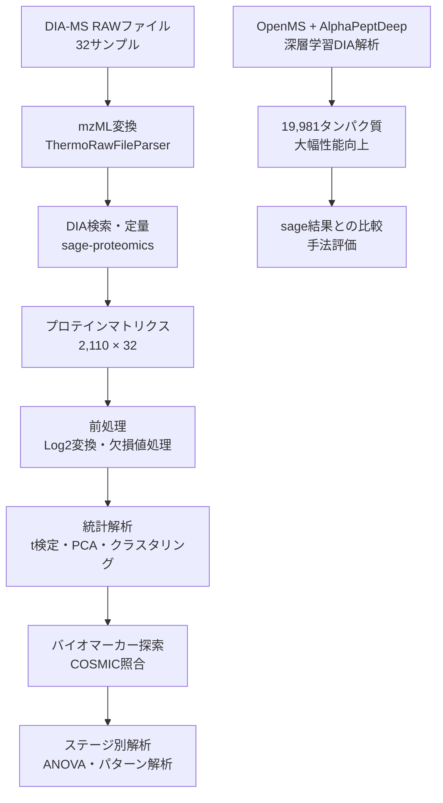

# 第0章: DIA-MSプロテオミクスの世界

## この章で学ぶこと

- DIA-MSプロテオミクスの基本概念と特徴
- フォローする論文（Toyota et al. 2025）の詳細
- 解析パイプラインの全体設計と戦略
- 無料ツールへの置き換え戦略

:::message
**プロテオミクス初心者の方へ**

本章に入る前に、AJACSの解説動画をご覧いただくことをおすすめします。LC-MS（液体クロマトグラフィー質量分析）の基礎原理からデータ解析の考え方まで、わかりやすく解説されています。

- [AJACS LC-MS解説動画（前編）](https://youtu.be/I9cArPIAkrw) — LC-MSの基本原理とプロテオミクスにおけるデータ取得の流れ
- [AJACS LC-MS解説動画（後編）](https://youtu.be/YSJ0BhvWWFw) — LC-MSデータの解析手法やバイオインフォマティクスへの応用

AJACS（あじゃっくす）は、バイオサイエンスデータベースセンター（NBDC）が主催するバイオインフォマティクスのトレーニングプログラムです。
:::

## DIA-MSプロテオミクスとは

### プロテオミクスの基本

**プロテオミクス**は、ある生命現象・疾患において発現する**全タンパク質（プロテオーム）**を網羅的に解析する学問分野です。

```
ゲノミクス（全遺伝子解析）
    ↓ 転写
トランスクリプトミクス（全RNA解析）
    ↓ 翻訳・修飾
プロテオミクス（全タンパク質解析）← 実際の機能分子
    ↓ 代謝
メタボロミクス（全代謝物解析）
```

**なぜタンパク質が重要か？**
- 酵素、構造タンパク質、シグナル分子として**実際に機能**
- 薬剤のターゲット（抗体医薬、低分子医薬の標的）
- バイオマーカー（診断・予後予測）

### DIA-MS vs DDA-MS

MS（質量分析）によるプロテオミクスには2つの主要な手法があります：

| 項目 | **DDA-MS** | **DIA-MS** |
|------|------------|-----------|
| **正式名称** | Data Dependent Acquisition | Data Independent Acquisition |
| **測定戦略** | 強度の高いピークを選択的に測定 | 全m/z範囲を均等に測定 |
| **再現性** | 低い（測定回ごとに検出タンパク質が変動） | **高い**（同じタンパク質を安定検出） |
| **定量精度** | 中程度 | **高い**（特に低発現タンパク質） |
| **解析難易度** | 簡単 | やや複雑（spectral libraryが必要） |
| **適用** | 新規タンパク質探索 | **大規模比較研究・臨床応用** |

**本論文でDIA-MSを選んだ理由**
- 16患者という大規模サンプルでの**定量比較**が主目的
- 大腸がん特異的タンパク質の**安定した検出**が必要
- 将来的な**バイオマーカー応用**を見据えた高再現性

## フォローする論文の詳細

### 論文情報

**Toyota N, Konno R, Iwata S, et al.**
"Identification of Cancer-Associated Proteins in Colorectal Cancer Using Mass Spectrometry."
*Proteomes* 2025; 13(3):38.
DOI: https://doi.org/10.3390/proteomes13030038

### 研究の背景

**大腸がん**は世界で3番目に多いがんであり、早期診断・個別化医療のための**分子バイオマーカー**の開発が急務です。

**従来の課題**
- 既存バイオマーカー（CEA、CA19-9等）の感度・特異度が不十分
- 組織レベルでの包括的なタンパク質解析データが限定的
- ステージ進行に伴うタンパク質変動パターンが不明

### 実験デザイン

```
【対象患者】
大腸がん患者 16人（Stage I-IV）

【サンプル収集】
各患者から 2サンプル × 16人 = 32サンプル
├─ 腫瘍組織（Tumor, T）
└─ 隣接正常組織（Normal, N）

【測定装置】
Orbitrap Exploris 480 (Thermo Fisher)
DIA-MS測定（90分グラジエント）

【論文の解析ツール】
├─ DIA-NN v1.8.1（タンパク質同定・定量）
├─ Perseus v1.6.15.0（統計解析）
└─ Python（可視化）
```

### 主要な発見

| 発見 | 詳細 | 生物学的意義 |
|------|------|-------------|
| **10,329タンパク質同定** | 腫瘍・正常組織から包括的に検出 | ヒトプロテオーム（～20,000タンパク質）の約50%をカバー |
| **531がん関連タンパク質** | COSMICデータベースとの照合 | 既知がん遺伝子産物の網羅的検証 |
| **48 CRC特異的タンパク質** | 大腸がんで特に重要なタンパク質群 | バイオマーカー候補・治療標的候補 |
| **ステージ別変動** | Stage I→IVでの一貫したタンパク質変動 | がん進行メカニズムの分子基盤 |

### 本書との比較

| 項目 | Toyota et al. 2025（原論文） | 本書での再現 |
|------|---------------------------|------------|
| **データ** | ProteomeXchange PXD058672 | **同じデータを使用** |
| **サンプル数** | 32サンプル（16患者 × 2組織） | **同じ** |
| **DIA解析** | DIA-NN v1.8.1（学術のみ無料） | **sage v0.14.7（MIT）** |
| **統計解析** | Perseus v1.6.15（商用不可） | **Python（BSD/MIT）** |
| **検出タンパク質** | 10,329個 | Sage: **2,110個** / OpenMS: **19,981個** |
| **有意差タンパク質** | 未記載 | Sage: **1,055個** |
| **COSMIC照合** | 531個 | Sage: **22個主要ドライバー** |

:::message alert
**本書の図について**

本シリーズ中の図（ヒートマップ・PCA・Volcanoプロット等）は、すべて**本書のパイプラインで独自に生成した再現図**です。論文のFigureを直接転載したものではありません。

使用ツールの違い（DIA-NN → sage）や同定タンパク質数の差により、論文オリジナルのFigureとは**細部が異なる場合があります**。
:::

## 解析パイプラインの全体設計

### 基本戦略



### 2つのパイプライン

本書では**2つの並行パイプライン**を実装し、手法比較を行います：

#### パイプライン A: sage基礎編
- **目的**: 商用利用可能な基本ワークフローの構築
- **特徴**: 軽量・高速、確実に動作
- **結果**: 2,110タンパク質、1,055個有意差

#### パイプライン B: OpenMS深層学習編
- **目的**: 最新技術による検出性能最大化
- **特徴**: 深層学習ペプチド予測、計算リソース消費
- **結果**: 19,981タンパク質（**9.5倍改善**）

## この章の構成

| セクション | タイトル | 内容 |
|-----------|---------|------|
| **0-1** | 背景・目的 | 大腸がん研究の現状と本研究の位置づけ |
| **0-2** | 論文紹介と解析戦略 | Toyota et al. 2025の詳細解説 |
| **0-3** | 無料ツールへの置き換え戦略 | 商用利用可能なツール選定理由 |

---

次のセクションでは、大腸がん研究の背景と本研究の学術的位置づけを詳しく見ていきましょう。