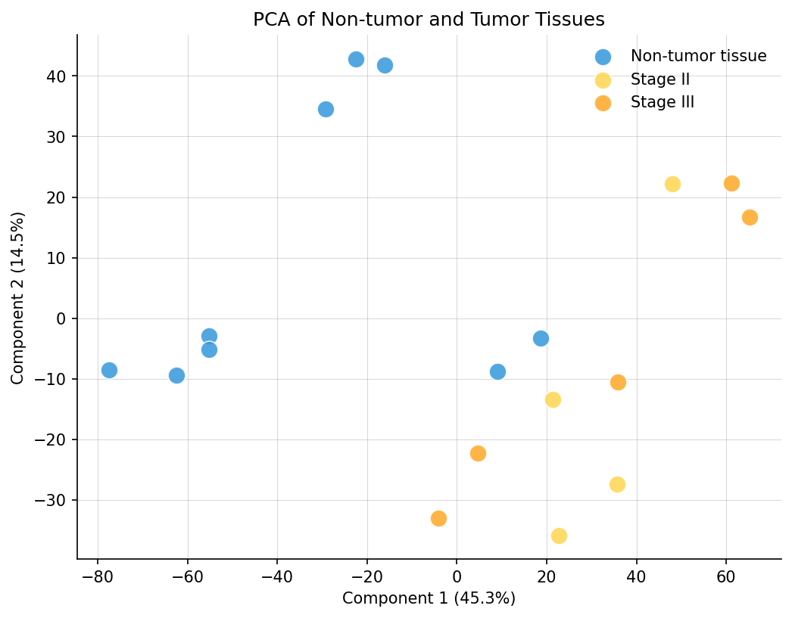

# 主成分分析 PCA（Figure 1c）

## このセクションで作る図



論文の Figure 1c に相当する、**15 サンプルを PC1–PC2 平面上に散布した図**です。Normal (青円) と Tumor (赤円) が明確に分離することを示します。

## PCA とは

**主成分分析 (Principal Component Analysis)** は、高次元データを低次元に要約する最も基本的な手法です。

### 基本的な考え方

2,381 タンパク質 × 15 サンプルのデータは、**15 個の点が 2,381 次元空間に散らばっている** と解釈できます。人間は 3 次元以上のデータを直感的に理解できないので、この 2,381 次元を **「点の散らばりが最大となる方向」を 2 本選んで 2 次元に投影** します。

- **PC1 (第1主成分)**: 最も分散が大きい方向
- **PC2 (第2主成分)**: PC1 と直交し、次に分散が大きい方向

PC1 と PC2 の 2 軸だけで元のデータの **何%の情報（分散）を説明できるか** を表すのが「寄与率 (explained variance ratio)」です。

### プロテオミクスでの解釈

Normal と Tumor でプロテオームが大きく異なる場合、**その違いが PC1 という 1 本の軸にほぼ集約される**はずです。これは「Normal と Tumor の差が、個別のタンパク質でバラバラに起きているのではなく、体系的に数十〜数百のタンパク質がまとめて上下していること」を意味します。

## コード

```python
def plot_pca(df, sample_info):
    # データ形状: タンパク質(行) × サンプル(列)
    # → PCAに渡すには サンプル(行) × タンパク質(列) に転置
    X = df.T.values

    # 標準化（平均0、分散1）
    X_centered = X - X.mean(axis=0)

    # PCA実行
    pca = PCA(n_components=2)
    scores = pca.fit_transform(X_centered)
    variance_ratio = pca.explained_variance_ratio_

    # 散布図
    fig, ax = plt.subplots(figsize=(8, 8))
    for idx, sample in enumerate(df.columns):
        cond = sample_info[sample_info["Sample"] == sample]["Condition"].values[0]
        color = COLOR_NORMAL if cond == "Normal" else COLOR_TUMOR
        ax.scatter(scores[idx, 0], scores[idx, 1], c=color, s=100,
                   edgecolor="black", linewidth=0.5, zorder=3)

    # 95%信頼楕円を群ごとに描画
    for condition, color in [("Normal", COLOR_NORMAL), ("Tumor", COLOR_TUMOR)]:
        mask = [sample_info[sample_info["Sample"] == s]["Condition"].values[0] == condition
                for s in df.columns]
        group_scores = scores[mask]
        _draw_confidence_ellipse(group_scores, ax, color)

    ax.set_xlabel(f"PC1 ({variance_ratio[0] * 100:.1f}%)", fontsize=14)
    ax.set_ylabel(f"PC2 ({variance_ratio[1] * 100:.1f}%)", fontsize=14)
    ax.axhline(0, color="gray", lw=0.5)
    ax.axvline(0, color="gray", lw=0.5)
    ax.legend()

    fig.savefig(os.path.join(FIG_DIR, "fig1c_pca.png"), dpi=300)
```

### コード詳細

- **`df.T.values`**: pandas DataFrame を転置して numpy 配列に変換。PCA は「行 = サンプル、列 = 特徴量（タンパク質）」を期待するため
- **`X - X.mean(axis=0)`**: サンプルごとに平均を引いて中心化（PCA の前処理として必須）
- **`PCA(n_components=2)`**: scikit-learn の PCA を主成分 2 本で実行
- **`pca.explained_variance_ratio_`**: 各主成分が全分散の何割を説明しているか（0〜1）
- **`pca.fit_transform(X)`**: 中心化データを PC1-PC2 空間に投影した座標を返す
- **`_draw_confidence_ellipse()`**: 各群の 95% 信頼楕円を描く補助関数（コードは省略。2×2共分散行列の固有値から楕円の長軸・短軸・傾きを計算）

## 本書での実測値

実行ログから得られる寄与率：

```
PC1: 41.5%
PC2: 17.4%
合計: 58.9%
```

この値は `results/tables/pca_variance.csv` にも保存されます：

```csv
PC,Variance_Ratio,Cumulative
PC1,0.415207755201763,0.415207755201763
PC2,0.17369717950520383,0.5889049347069668
```

## 論文との比較

| 指標 | 本書 (sage) | 論文 (DIA-NN) |
|------|------------|--------------|
| **PC1 寄与率** | **41.5%** | **42.1%** |
| PC2 寄与率 | 17.4% | 10.8% |
| PC1+PC2 合計 | 58.9% | 52.9% |
| Normal/Tumor 分離 | 明確 | 明確 |

### PC1 寄与率が論文とほぼ完全一致する意味

論文 42.1% に対して本書 **41.5%** という数字は、偶然ではなく **「腫瘍化による全体的なプロテオームの歪み」が PC1 という軸で約40% 捉えられる** という、生物学的に意味のある現象が再現されていることを意味します。

使っているツール（DIA-NN vs sage）、サンプル数（32 vs 15）、同定タンパク質数（10,329 vs 2,381）が違うにも関わらず、**PC1 寄与率がほぼ一致する**のは、大腸がんの Tumor/Normal 対比が強い生物学的シグナルを持っていることの証拠です。

### PC2 寄与率が違う理由

本書の PC2 が 17.4% と高めなのは、サンプル数が 15 と少ないため個体差が PC2 に乗りやすいためです。論文の 32 サンプルではこの個体差が平均化され、PC2 は 10.8% に落ちます。

## 結果の読み方

PCA 散布図で確認するポイント：

1. **Normal と Tumor が PC1 軸で分離しているか**（本書データでは明確に分離）
2. **各群内でサンプルがまとまっているか**（ばらつきが大きいと群内ノイズが多い）
3. **外れ値サンプルがいないか**（楕円から遠く離れたサンプルは要注意）

これらが良好に見えれば、次の差分発現解析（第7章）で統計検定にかける準備ができたと判断できます。

## まとめ

- PCA は高次元データを 2 次元に要約して群構造を一目で確認するための基本ツール
- 本書データでの PC1 寄与率 **41.5%** は論文（42.1%）とほぼ一致
- Normal/Tumor の分離は本書でも明確に再現された
- サンプル数が違うためPC2 寄与率は論文と少し異なる（17.4% vs 10.8%）

次章（第7章）では、この「PC1 軸に乗っている変動を具体的にどのタンパク質が担っているのか」を、t検定と Volcano プロットで特定します。
