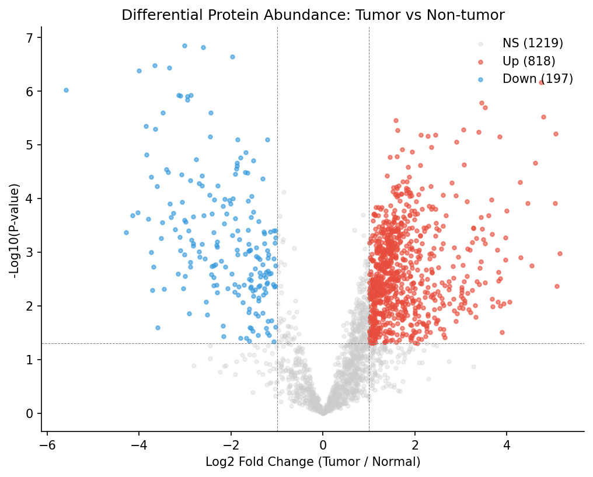

# Volcano プロット

## Volcano プロットとは

**Volcano プロット (volcano plot)** は、差分発現解析の結果を **Log2 Fold Change（横軸） × -log10(p-value)（縦軸）** の散布図で表現する標準的な可視化手法です。火山の噴火の形に似ているためこの名前が付きました。

```
-log10(p)
   ↑
   │                  ⚫                  ⚫
   │                ⚫  ⚫                ⚫
   │              ⚫      ⚫             ⚫
   │            ⚫          ⚫         ⚫
   │          ⚫              ⚫     ⚫
   │        ⚫                  ⚫ ⚫
   │      ⚫                    ⚫
   ├─────────────────────────────────────→
          -1        0         +1      log2 FC
       (Down)              (Up)
```

- **右上の点**: Up-regulated（Tumor で高い）かつ有意
- **左上の点**: Down-regulated（Tumor で低い）かつ有意
- **下の方**: 有意差なし

p-value が小さいほど -log10(p) が大きくなるため、**上に行くほど統計的に有意** になります。

## コード

```python
def plot_volcano(de_results, fig_path):
    """Volcano プロットを描画。"""
    fc = de_results["log2_fc"]
    neg_log_p = -np.log10(de_results["p_value"])

    # 有意/非有意で色分け
    is_up = (de_results["significant"] == "Up")
    is_down = (de_results["significant"] == "Down")
    is_ns = ~(is_up | is_down)

    fig, ax = plt.subplots(figsize=(8, 8))
    ax.scatter(fc[is_ns], neg_log_p[is_ns], c="lightgray", s=15,
               label="NS", alpha=0.6)
    ax.scatter(fc[is_down], neg_log_p[is_down], c=COLOR_NORMAL, s=25,
               label=f"Down ({is_down.sum()})", edgecolor="black", lw=0.2)
    ax.scatter(fc[is_up], neg_log_p[is_up], c=COLOR_TUMOR, s=25,
               label=f"Up ({is_up.sum()})", edgecolor="black", lw=0.2)

    # 閾値線
    ax.axvline(-1, color="gray", ls="--", lw=0.7)
    ax.axvline(+1, color="gray", ls="--", lw=0.7)
    ax.axhline(-np.log10(0.05), color="gray", ls="--", lw=0.7)

    # 上位タンパク質をラベル表示
    top_up = de_results[is_up].sort_values("p_value").head(10)
    top_down = de_results[is_down].sort_values("p_value").head(10)
    for name, row in pd.concat([top_up, top_down]).iterrows():
        ax.annotate(name, (row["log2_fc"], -np.log10(row["p_value"])),
                    fontsize=8, ha="center")

    ax.set_xlabel("log2(Fold Change)  [Tumor / Normal]")
    ax.set_ylabel("-log10(p-value)")
    ax.set_title(f"Volcano Plot  (total: {len(de_results)}, sig: {(is_up|is_down).sum()})")
    ax.legend()

    fig.savefig(fig_path, dpi=300)
```

### コード詳細

- **`-np.log10(p_value)`**: p値を負の対数に変換。p=0.05 なら -log10(0.05) ≈ 1.30、p=0.001 なら 3、p=1e-10 なら 10
- **色分け**: 非有意（灰）、Down（青）、Up（赤）の 3 色
- **`ax.axvline(-1, ...)`、`ax.axvline(+1, ...)`**: Log2 FC = ±1（2倍変化）の閾値線
- **`ax.axhline(-np.log10(0.05), ...)`**: p=0.05 の閾値線
- **`top_up.sort_values("p_value").head(10)`**: p値が小さい上位10個を取り出してラベル表示
- **`ax.annotate(...)`**: 散布図上に遺伝子名を表示

## 本書データでの結果



- **灰色の点**: 有意差なし（1,427個）
- **赤い点**: Up-regulated 755個
- **青い点**: Down-regulated 199個
- 上位の遺伝子名がラベル表示される

## 結果の読み方

Volcano プロットで最初に見るべき点：

1. **左右対称か？**
   - 対称なら Up/Down ほぼ同数で、生物学的に両方向の変動がバランスよく起きている
   - 非対称なら片方向への偏りがある（本書では Up に偏っている）

2. **「火山」の形になっているか？**
   - 中央下部（低 FC、低有意性）から左右上方向に広がる形
   - 極端に非対称だとバッチ効果や外れ値の疑い

3. **上位ラベルは納得できる遺伝子か？**
   - 大腸がん関連の既知遺伝子（例: CEACAM5, CEACAM6, MYC 標的など）があれば説得力が増す

## なぜ生の p-value を使うのか

論文は多重検定補正（FDR）を明示的に使っていません（2群比較では生 p-value）。その代わり、**「Fold change > 2」という 2 重基準** で実質的にノイズを抑えています。

FDR 補正を入れたい場合は、以下のように `differential_proteins.csv` に追加できます：

```python
from statsmodels.stats.multitest import multipletests
de_results["adj_p_value"] = multipletests(de_results["p_value"], method="fdr_bh")[1]
```

本書では論文に合わせて生 p-value を使います。

## 論文の Figure 2 との対応

論文は Figure 2 を Volcano プロットとしてではなく、**Figure 2a: ヒートマップ、Figure 2b: PCA** として表現しています。本書ではこれに加えて、**ボーナス図として Volcano プロット**を作成しています。Volcano プロットは論文本文には無いものの、差分発現解析では業界標準の可視化なので、読者の学習に役立ちます。

## まとめ

- Volcano プロットは Log2 FC × -log10(p) の散布図で、差分発現解析の結果を一目で把握するための基本可視化
- 本書データでは 954 個の有意差タンパク質（Up 755 + Down 199）が火山の両肩に分布
- 上位10個ずつには遺伝子名ラベルを表示してバイオロジカル解釈を支援
- 論文にはない「ボーナス図」として提供

次節 (7-3) では、これらの有意差タンパク質を発現差の大きさ順で絞り込み、**Top 50/100/200** でクラスタリング・PCA を再描画します。
