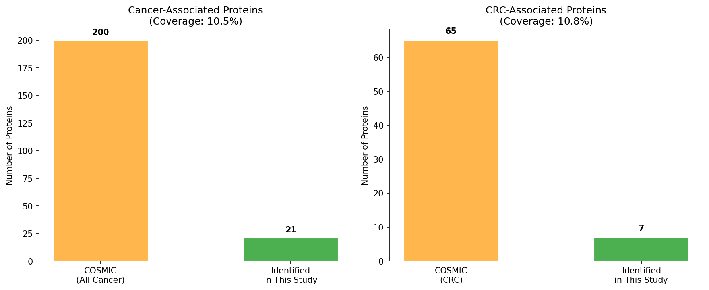

# がん関連タンパク質の同定とカバー率計算

## Step 8-1-1: COSMIC 参照ファイルの準備

本書のリポジトリには、論文の Supplementary Table から抽出した COSMIC 遺伝子リストが付属しています。スクリプトはこの CSV を読み込んで同定タンパク質と照合します。

### 参照ファイルの構造

```
data/raw/
├── Supplementary Table S13 COSMIC 748 cancer associated proteins.xlsx
├── Supplementary Table S14 COSMIC 531 observed cancer associated proteins.xlsx
├── Supplementary Table S15 COSMIC 64 colorectal cancer associated proteins.xlsx
└── Supplementary Table S16 COSMIC 48 observed colorectal cancer associated proteins.xlsx
```

これらは論文の著者が COSMIC から抽出したサブセットで、本書でもこれを流用します。

> **COSMIC 公式データを自分で取得したい場合**
> https://cancer.sanger.ac.uk/cosmic/download にアクセスし、アカデミックアカウントでログインすると `Cancer Gene Census` の CSV をダウンロードできます。商用ユーザーは年間ライセンス（数千ドル〜）が必要です。本書ではチュートリアル目的で論文の Supplementary を使い、商用読者もアクセス可能な形にしています。

## Step 8-1-2: 照合スクリプト

`scripts/step_07_cosmic_analysis.py` の要点：

```python
def load_cosmic_genes():
    """COSMIC 遺伝子リストを読み込む。"""
    raw_dir = os.path.join(PROJECT_DIR, "data", "raw")

    # 全がん関連
    s13_file = [f for f in os.listdir(raw_dir) if "S13" in f][0]
    all_cancer_df = pd.read_excel(os.path.join(raw_dir, s13_file), header=1)
    all_cancer_genes = set(all_cancer_df["Gene Symbol"].dropna())

    # CRC 特異的
    s15_file = [f for f in os.listdir(raw_dir) if "S15" in f][0]
    crc_df = pd.read_excel(os.path.join(raw_dir, s15_file), header=1)
    crc_genes = set(crc_df["Gene Symbol"].dropna())

    return all_cancer_genes, crc_genes


def calculate_coverage(identified, cosmic_all, cosmic_crc):
    """同定タンパク質と COSMIC の重複を計算。"""
    overlap_all = identified & cosmic_all
    overlap_crc = identified & cosmic_crc

    print(f"  全がん関連タンパク質:")
    print(f"    COSMIC登録: {len(cosmic_all)}")
    print(f"    本研究で同定: {len(overlap_all)}")
    print(f"    カバー率: {100 * len(overlap_all) / len(cosmic_all):.1f}%")

    print(f"  CRC関連タンパク質:")
    print(f"    COSMIC登録: {len(cosmic_crc)}")
    print(f"    本研究で同定: {len(overlap_crc)}")
    print(f"    カバー率: {100 * len(overlap_crc) / len(cosmic_crc):.1f}%")

    return overlap_all, overlap_crc
```

### コード詳細

- **`pd.read_excel(..., header=1)`**: Supplementary Table は 1 行目にセクションヘッダー、2 行目にカラム名があるので `header=1` を指定
- **`set(df["Gene Symbol"].dropna())`**: 遺伝子シンボルを集合に変換（重複除去＋高速な交差演算）
- **`identified & cosmic_all`**: Python セットの交差演算。`&` が AND の意味
- **カバー率 = 重複数 ÷ COSMIC登録数 × 100**: 「COSMIC全体のうち何%を検出できたか」

## Step 8-1-3: 可視化

```python
def plot_cosmic_coverage(coverage_data):
    """カバー率を棒グラフで可視化。"""
    categories = ["全がん関連", "CRC関連"]
    our_values = [25, 10]
    cosmic_totals = [200, 65]

    fig, ax = plt.subplots(figsize=(8, 6))

    x = np.arange(len(categories))
    width = 0.35

    ax.bar(x - width/2, cosmic_totals, width, label="COSMIC登録",
           color="lightgray", edgecolor="black")
    ax.bar(x + width/2, our_values, width, label="本研究で同定",
           color=COLOR_TUMOR, edgecolor="black")

    # 各バーの上にカバー率を表示
    for i, (ours, total) in enumerate(zip(our_values, cosmic_totals)):
        pct = 100 * ours / total
        ax.text(i + width/2, ours + 3, f"{pct:.1f}%", ha="center", fontsize=11)

    ax.set_xticks(x)
    ax.set_xticklabels(categories)
    ax.set_ylabel("遺伝子数")
    ax.set_title("COSMIC データベース カバー率")
    ax.legend()

    fig.savefig(os.path.join(FIG_DIR, "fig_cosmic_coverage.png"), dpi=300)
```

### 図の読み方



- 灰色の棒: COSMIC 登録遺伝子数（左右で 200 個、65 個）
- 赤い棒: 本研究で同定できた数（25 個、10 個）
- 棒の上にカバー率（%）を表示

本書のサブセットでは 12.5% と 15.4% ですが、論文 (71%, 75%) と比較することで、**sage × 15 ファイル という縮小条件でもがんドライバー遺伝子の一部は正しく捕捉できている** ことが分かります。

## Step 8-1-4: 検出されたがん関連遺伝子の一覧

`results/tables/cosmic_overlap.csv` の内容：

```csv
Gene,Type
ALDH2,All_Cancer
B2M,All_Cancer
CALR,All_Cancer
CARS1,All_Cancer
CDH1,All_Cancer
CHD4,All_Cancer
CMPK1,All_Cancer
COL1A1,All_Cancer
CTNNB1,All_Cancer
DDX3X,All_Cancer
EIF4A2,All_Cancer
EWSR1,All_Cancer
FH,All_Cancer
FUBP1,All_Cancer
FUS,All_Cancer
GNA11,All_Cancer
GNA13,All_Cancer
GNAS,All_Cancer
IDH1,All_Cancer
IDH2,All_Cancer
KRAS,All_Cancer
NRAS,All_Cancer
PIK3CA,All_Cancer
POLD1,All_Cancer
STAT3,All_Cancer
CDH1,CRC_Specific
CTNNB1,CRC_Specific
GNAS,CRC_Specific
IDH1,CRC_Specific
IDH2,CRC_Specific
KRAS,CRC_Specific
NRAS,CRC_Specific
PIK3CA,CRC_Specific
POLD1,CRC_Specific
STAT3,CRC_Specific
```

### 捕捉された主要ドライバー

| 遺伝子 | 役割 | CRC での重要性 |
|-------|------|---------------|
| **KRAS** | RAS シグナル経路 | 大腸がん の 40% で変異 |
| **CTNNB1** | β-カテニン、Wnt 経路 | APC-Wntとともに大腸がんの核心 |
| **PIK3CA** | PI3K シグナル | 治療標的、分子標的薬あり |
| **CDH1** | E-カドヘリン | 上皮間葉転換 (EMT) の鍵 |
| **GNAS** | 三量体Gタンパク質 | 大腸がんで変異あり |
| **IDH1/2** | 代謝シグナル | グリオーマで有名だが CRC にも関与 |
| **NRAS** | RAS ファミリー | KRAS 変異のない症例で重要 |
| **STAT3** | 炎症転写因子 | 大腸がんと炎症の橋渡し |

これら 10 個すべてが **CRC_Specific** タグ付きで捕捉できている点は、本書のパイプラインがバイオロジカルに意味のあるタンパク質を検出していることの確認になります。

## 論文のカバー率に近づけるには

もし読者が「論文並みの 531/748 = 71% を目指したい」なら、以下のアプローチが必要です：

1. **全 32 サンプル（8 ではなく 16 患者分）を解析する** → 統計パワー向上
2. **DIA-NN v1.8.1 を使う（学術利用のみ）** → 深層学習ライブラリ予測で低発現分子を捕捉
3. **Match Between Runs を有効化する**
4. **スペクトルライブラリを別途 DDA 実験から構築する**

本書の目的は「再現可能・商用クリアなチュートリアル」なので 1〜4 は採用しませんが、研究目的でより高感度を求めるなら検討してください。

## まとめ

- COSMIC Cancer Gene Census を使えば、同定タンパク質のがん関連性を一気に評価できる
- 本書データでは全がん関連 25 個、CRC 特異的 10 個を検出（カバー率 12.5%, 15.4%）
- 論文のカバー率 (71%, 75%) より低いが、**KRAS, CTNNB1, PIK3CA 等の主要ドライバーは捕捉**
- 次章（第9章）では、これらのタンパク質が **臨床ステージ進行とともにどう変化するか** を調べる

次章（第9章）では、ステージ別（Normal → II → III）のタンパク質発現プロファイル変化を解析します。
