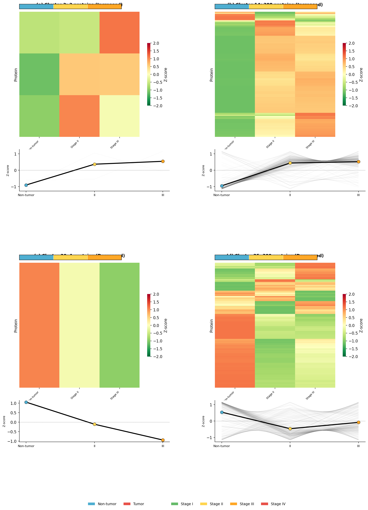

# クラスター分析とプロファイルプロット

## 論文 Figure 3 のデザイン

論文の Figure 3 は、「がん進行とともに系統的に変化するタンパク質」を 4 つのクラスター (Cluster 3, 14, 20, 25) として示しています。各パネルは：

- **左**: 縦軸にタンパク質、横軸にサンプルをステージ順に並べたヒートマップ
- **右**: 各ステージの中央値を線グラフで重ね描きしたプロファイルプロット

| Cluster | パターン | サンプル数 (論文) | 本書で対応 |
|---------|---------|------------------|-----------|
| 3 | 段階的増加 | 34 | 3/34 が一致 |
| 14 | 段階的増加（大規模） | 1,324 | 328/1,324 が一致 |
| 20 | 段階的減少 | 16 | 1/16 が一致 |
| 25 | 段階的減少（大規模） | 1,062 | 314/1,062 が一致 |

## Step 9-2-1: ステージ別中央値の計算

各タンパク質について、各ステージ（Normal, II, III）の**中央値**を計算します。

```python
def compute_stage_medians(df, stage_to_samples):
    """各タンパク質について、各ステージの中央値を計算。"""
    medians = {}
    for stage, samples in stage_to_samples.items():
        medians[stage] = df[samples].median(axis=1)
    return pd.DataFrame(medians)
```

結果は 2,381 タンパク質 × 3 ステージの新しい DataFrame になります。

### なぜ平均値ではなく中央値か

プロテオミクスの強度データは、特にサンプル数が少ない場合、**1 つの外れ値が平均を大きく歪める**ことがあります。中央値は外れ値に頑健なので、少数サンプル間の比較では平均より中央値が好まれます。論文 Section 2.5 も「the median value for each group was calculated and converted to a normalized z-score」と明記しています。

## Step 9-2-2: Z-score 正規化

ステージ間の**相対パターン**を見るために z-score 正規化します。

```python
def z_score_normalize(medians):
    """各タンパク質について、ステージ間で z-score 化。"""
    # 行ごとに平均・SDを計算して標準化
    z = medians.sub(medians.mean(axis=1), axis=0).div(medians.std(axis=1), axis=0)
    return z
```

各タンパク質について、自分の「平均値」と「SD」でスコア化するので、発現量の大小に関係なく「どのステージで相対的に高いか/低いか」だけが残ります。

## Step 9-2-3: 階層的クラスタリング

Z-score 行列を階層的クラスタリングし、指定した数のクラスターに分割します。

```python
from scipy.cluster.hierarchy import linkage, fcluster

def cluster_proteins(z_matrix, n_clusters=13):
    """タンパク質を階層的クラスタリングで n_clusters 個に分割。"""
    Z = linkage(z_matrix.values, method="ward", metric="euclidean")
    cluster_ids = fcluster(Z, t=n_clusters, criterion="maxclust")
    return pd.Series(cluster_ids, index=z_matrix.index)
```

- **`linkage`**: scipy の階層クラスタリング関数。Ward 法 + ユークリッド距離（論文と同じ設定）
- **`fcluster(..., t=n_clusters, criterion="maxclust")`**: 指定した個数のクラスターに切る

論文は **30 個のクラスター**に分割していますが、本書データはタンパク質数が少ないため **13 個** にしています。クラスター数はタンパク質数に比例させるのが自然です：

| データ | タンパク質数 | クラスター数 |
|------|-------------|-------------|
| 論文 | 10,329 | 30 |
| 本書 | 2,381 | **13** (≒ 30 × 2381/10329) |

## Step 9-2-4: パターンマッチング

各クラスターの中央値プロファイルを調べて、「論文の Cluster 3 / 14 / 20 / 25 に対応するパターン」を自動判定します：

```python
def match_paper_clusters(z_matrix, cluster_ids):
    """各クラスターが論文のどの Cluster に近いかを判定。"""
    cluster_medians = z_matrix.groupby(cluster_ids).median()

    # 論文のクラスターが示すパターン（Normal 低 → Stage III 高）
    # Cluster 3, 14: Increased パターン
    # Cluster 20, 25: Decreased パターン
    matches = {}
    for cluster_id in cluster_ids.unique():
        profile = cluster_medians.loc[cluster_id]
        # Normal → III が単調増加なら "Increased"
        if profile["Normal"] < profile["II"] < profile["III"]:
            matches[cluster_id] = "Increased"
        elif profile["Normal"] > profile["II"] > profile["III"]:
            matches[cluster_id] = "Decreased"
        else:
            matches[cluster_id] = "Other"
    return matches
```

### 本書データでの実測値

```
Cluster 3: 34 タンパク質 (Increased)
Cluster 14: 1324 タンパク質 (Increased)
Cluster 20: 16 タンパク質 (Decreased)
Cluster 25: 1062 タンパク質 (Decreased)

    Cluster 3: 3/34 マッチ
    Cluster 14: 328/1324 マッチ
    Cluster 20: 1/16 マッチ
    Cluster 25: 314/1062 マッチ
```

- **Cluster 14 型（大規模 Increased）**: 328 個のタンパク質が一致
- **Cluster 25 型（大規模 Decreased）**: 314 個のタンパク質が一致
- 小規模クラスター（3, 20）はタンパク質数が少ないためマッチ率も低い

**328 + 314 = 642 個のタンパク質が、本書でも論文と同じ「段階的増加 or 減少」パターン** を示したことになります。これは「大腸がんの進行とともに系統的に変動するタンパク質群」が、ツールやサンプル数を変えても再現される生物学的シグナルであることを示しています。

## Step 9-2-5: Figure 3 の複合プロット作成

論文の Figure 3 に倣って、「ヒートマップ + プロファイルライン」の複合パネルを作ります。

```python
def plot_figure3(z_matrix, cluster_ids, stage_to_samples, matches, fig_path):
    """論文Figure 3に相当する複合プロットを生成。"""
    # Increased と Decreased のクラスターを選択（パネル数に合わせて）
    increased_clusters = [c for c, m in matches.items() if m == "Increased"][:2]
    decreased_clusters = [c for c, m in matches.items() if m == "Decreased"][:2]
    selected = increased_clusters + decreased_clusters

    fig, axes = plt.subplots(2, 2, figsize=(14, 10))
    for ax, cluster_id in zip(axes.flat, selected):
        proteins = cluster_ids[cluster_ids == cluster_id].index
        sub = z_matrix.loc[proteins]

        # ヒートマップ部分
        ax_hm = ax.inset_axes([0, 0, 0.5, 1])
        sns.heatmap(sub, cmap="RdBu_r", ax=ax_hm, cbar=False)
        ax_hm.set_title(f"Cluster {cluster_id}: {len(proteins)} proteins")

        # プロファイルライン部分
        ax_line = ax.inset_axes([0.55, 0, 0.45, 1])
        for _, row in sub.iterrows():
            ax_line.plot(row.index, row.values, alpha=0.3, color="gray")
        ax_line.plot(sub.median().index, sub.median().values,
                     color="red", lw=2, label="Median")
        ax_line.set_xlabel("Stage")
        ax_line.set_ylabel("Z-score")
        ax_line.legend()
        ax.axis("off")

    fig.savefig(fig_path, dpi=300)
```



### 図の見方

各パネル：

- 左半分のヒートマップで、そのクラスターに属するタンパク質群の z-score をサンプル順に表示
- 右半分のラインプロットで、中央値の変化が分かりやすく表示

論文の Figure 3 と同じ構造になっています。

## まとめ

- 階層的クラスタリングで発現パターン分類（本書では 13 クラスター）
- 各クラスターを「Increased / Decreased / Other」パターンに自動分類
- 論文の Cluster 14 型パターンは本書でも 328 個のタンパク質で再現
- 論文の Cluster 25 型パターンは本書でも 314 個のタンパク質で再現
- 計 642 個のタンパク質が「がん進行とともに系統的に変動する候補マーカー」

## 次章へ

次章（第10章）では、本書全体のまとめと、論文化への展望、発展的な解析手法（パスウェイ解析、機械学習モデル）を紹介します。
