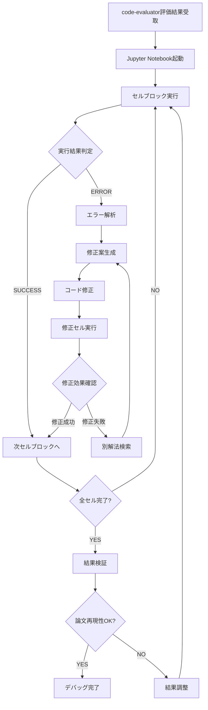

# Code Debug Skill

Jupyter Notebook上でのコード実行・デバッグ・修正を確実に行い、エラーゼロかつ論文再現性を達成するまで繰り返し実行する。

## 確実動作ループアーキテクチャ

### ループフロー設計



**ループ制御パラメータ**:
- 最大ループ回数: 5周（無限ループ防止）
- セル単位タイムアウト: 300秒（長時間処理対応）
- エラー連続発生限界: 同一セルで3回
- メモリ監視閾値: 使用量80%超過で警告

## 段階的実行システム

### Phase 1: 実行環境セットアップ

**1.1 Jupyter Notebook環境確認**:
```python
def setup_jupyter_environment():
    """Jupyter実行環境を初期化・確認する"""

    import sys
    import subprocess
    from pathlib import Path

    # Jupyter kernelの確認
    try:
        result = subprocess.run(['jupyter', '--version'], capture_output=True, text=True)
        print(f"✅ Jupyter version: {result.stdout.strip()}")
    except FileNotFoundError:
        print("❌ Jupyter not found. Installing...")
        subprocess.run([sys.executable, '-m', 'pip', 'install', 'jupyter'], check=True)

    # kernelスペック確認
    kernel_result = subprocess.run(['jupyter', 'kernelspec', 'list'], capture_output=True, text=True)
    print(f"Available kernels:\n{kernel_result.stdout}")

    # メモリ・CPU情報取得
    import psutil
    memory_gb = psutil.virtual_memory().total / (1024**3)
    cpu_count = psutil.cpu_count()
    print(f"💾 Available RAM: {memory_gb:.1f} GB")
    print(f"🔧 CPU cores: {cpu_count}")

    return {
        'jupyter_available': True,
        'memory_gb': memory_gb,
        'cpu_count': cpu_count
    }
```

**1.2 依存関係の最終確認・自動修正**:
```python
def auto_fix_dependencies(evaluation_results):
    """code-evaluatorの結果を受けて依存関係を自動修正"""

    missing_deps = evaluation_results.get('missing_dependencies', [])
    version_conflicts = evaluation_results.get('version_conflicts', [])

    if missing_deps:
        print(f"🔧 Installing missing dependencies: {missing_deps}")
        for package in missing_deps:
            try:
                subprocess.run([sys.executable, '-m', 'pip', 'install', package], check=True)
                print(f"✅ {package} installed successfully")
            except subprocess.CalledProcessError as e:
                print(f"❌ Failed to install {package}: {e}")

    if version_conflicts:
        print(f"⚠️ Version conflicts detected: {version_conflicts}")
        # 競合解決の提案
        for conflict in version_conflicts:
            suggest_version_fix(conflict)
```

### Phase 2: セル実行エンジン

**2.1 セルブロック実行システム**:
```python
class NotebookExecutor:
    """Jupyter Notebookの段階的実行を管理するクラス"""

    def __init__(self, notebook_path):
        self.notebook_path = Path(notebook_path)
        self.nb = nbformat.read(notebook_path, as_version=4)
        self.execution_log = []
        self.current_variables = {}
        self.error_count = 0

    def execute_cell_block(self, start_cell, end_cell, timeout=300):
        """指定範囲のセルブロックを実行"""

        print(f"🚀 Executing cells {start_cell}-{end_cell}")

        execution_result = {
            'start_cell': start_cell,
            'end_cell': end_cell,
            'status': 'running',
            'outputs': [],
            'errors': [],
            'execution_time': 0
        }

        start_time = time.time()

        for cell_idx in range(start_cell, end_cell + 1):
            if cell_idx >= len(self.nb.cells):
                break

            cell = self.nb.cells[cell_idx]
            if cell.cell_type == 'code':
                cell_result = self.execute_single_cell(cell, cell_idx, timeout)
                execution_result['outputs'].append(cell_result)

                if cell_result['status'] == 'error':
                    execution_result['status'] = 'error'
                    execution_result['errors'].append(cell_result)
                    break

        execution_result['execution_time'] = time.time() - start_time
        if execution_result['status'] != 'error':
            execution_result['status'] = 'success'

        self.execution_log.append(execution_result)
        return execution_result

    def execute_single_cell(self, cell, cell_idx, timeout):
        """単一セルの実行"""

        print(f"  📝 Cell {cell_idx}: {cell.source[:50]}...")

        try:
            # IPythonでセル実行をシミュレート
            exec_result = self.execute_cell_code(cell.source, timeout)

            print(f"  ✅ Cell {cell_idx}: Success")
            return {
                'cell_index': cell_idx,
                'status': 'success',
                'output': exec_result.get('output', ''),
                'variables_created': exec_result.get('variables_created', []),
                'memory_usage': exec_result.get('memory_usage', 0)
            }

        except Exception as e:
            print(f"  ❌ Cell {cell_idx}: Error - {str(e)}")
            return {
                'cell_index': cell_idx,
                'status': 'error',
                'error_type': type(e).__name__,
                'error_message': str(e),
                'code_snippet': cell.source
            }
```

**2.2 リアルタイムエラー検出**:
```python
def real_time_error_detection(execution_result):
    """実行中のエラーをリアルタイム検出・分類"""

    if execution_result['status'] != 'error':
        return None

    error_types = {
        'ImportError': 'dependency_missing',
        'FileNotFoundError': 'file_missing',
        'MemoryError': 'insufficient_memory',
        'ModuleNotFoundError': 'module_missing',
        'KeyError': 'data_key_missing',
        'ValueError': 'data_format_error',
        'TypeError': 'type_mismatch',
        'NameError': 'variable_undefined',
        'IndexError': 'data_index_error',
        'ConnectionError': 'network_issue'
    }

    for error in execution_result['errors']:
        error_type = error['error_type']
        error_category = error_types.get(error_type, 'unknown_error')

        print(f"🔍 Error detected: {error_type} -> {error_category}")

        # エラー別の自動修正を試行
        auto_fix_result = attempt_auto_fix(error, error_category)
        if auto_fix_result['fixed']:
            print(f"🔧 Auto-fixed: {auto_fix_result['fix_description']}")
            return auto_fix_result
        else:
            print(f"❌ Auto-fix failed: {auto_fix_result['reason']}")

    return None
```

### Phase 3: インテリジェント修正システム

**3.1 エラーパターンマッチング修正**:
```python
def intelligent_error_fixing(error_info):
    """エラー内容を解析して適切な修正案を生成"""

    error_type = error_info['error_type']
    error_message = error_info['error_message']
    code_snippet = error_info['code_snippet']

    # 修正パターンのデータベース
    fix_patterns = {
        'ImportError': [
            {
                'pattern': r"No module named '(\w+)'",
                'fix_template': 'pip install {module}',
                'code_fix': '# !pip install {module}\nimport {module}'
            },
            {
                'pattern': r"cannot import name '(\w+)' from '(\w+)'",
                'fix_template': 'Update {package} or use alternative import',
                'code_fix': 'try:\n    from {package} import {function}\nexcept ImportError:\n    # Alternative import'
            }
        ],
        'FileNotFoundError': [
            {
                'pattern': r"No such file or directory: '([^']+)'",
                'fix_template': 'Create file {file} or adjust path',
                'code_fix': 'import os\nos.makedirs(os.path.dirname("{file}"), exist_ok=True)'
            }
        ],
        'MemoryError': [
            {
                'pattern': r'.*',
                'fix_template': 'Reduce data size or process in chunks',
                'code_fix': '# Process data in smaller chunks\nfor chunk in pd.read_csv(file, chunksize=1000):\n    process_chunk(chunk)'
            }
        ]
    }

    if error_type in fix_patterns:
        for pattern_info in fix_patterns[error_type]:
            match = re.search(pattern_info['pattern'], error_message)
            if match:
                # パターンマッチしたエラーの修正案生成
                fix_vars = match.groups() if match.groups() else []
                fix_description = pattern_info['fix_template'].format(*fix_vars)
                fixed_code = pattern_info['code_fix'].format(*fix_vars)

                return {
                    'fix_available': True,
                    'fix_description': fix_description,
                    'fixed_code': fixed_code,
                    'fix_type': 'pattern_match'
                }

    # パターンマッチしない場合は汎用修正
    return generate_generic_fix(error_info)
```

**3.2 コンテキスト aware修正**:
```python
def context_aware_fixing(error_info, execution_context):
    """実行コンテキストを考慮した修正案生成"""

    # 前のセルで定義された変数を確認
    available_vars = execution_context.get('current_variables', {})

    # データフレームの列名を確認
    dataframe_vars = [v for v, t in available_vars.items() if 'DataFrame' in str(t)]

    # プロテオミクス特有のエラーパターン
    proteomics_fixes = {
        'KeyError': {
            'protein_not_found': 'Check protein name spelling or use alternative identifier',
            'column_not_found': f'Available columns: {list(available_vars.keys())}',
        },
        'ValueError': {
            'data_format_mismatch': 'Convert data types or handle missing values',
            'array_shape_mismatch': 'Check array dimensions and reshape if needed'
        }
    }

    # コンテキストベースの修正提案
    if error_info['error_type'] in proteomics_fixes:
        context_fixes = proteomics_fixes[error_info['error_type']]
        for fix_name, fix_desc in context_fixes.items():
            if applicable_to_context(error_info, fix_name, execution_context):
                return generate_context_fix(error_info, fix_desc, execution_context)

    return None
```

### Phase 4: 論文再現性検証

**4.1 図表比較システム**:
```python
def verify_figure_reproduction(generated_figure, reference_paper_info):
    """生成した図と論文のFigureを比較検証"""

    import matplotlib.pyplot as plt
    from PIL import Image
    import numpy as np

    # 生成された図を読み込み
    if isinstance(generated_figure, str):  # ファイルパス
        gen_img = Image.open(generated_figure)
    else:  # matplotlib Figure
        gen_img = figure_to_image(generated_figure)

    # 論文のFigure情報と比較
    comparison_results = {
        'visual_similarity': 0.0,
        'data_range_match': False,
        'plot_type_match': False,
        'axis_labels_match': False,
        'color_scheme_similar': False
    }

    # 基本的な図表特性を抽出
    gen_features = extract_plot_features(gen_img)

    # 論文で報告されている数値範囲と比較
    if 'expected_data_range' in reference_paper_info:
        comparison_results['data_range_match'] = check_data_range_match(
            gen_features, reference_paper_info['expected_data_range']
        )

    # 視覚的類似度スコア算出
    if 'reference_figure' in reference_paper_info:
        ref_img = Image.open(reference_paper_info['reference_figure'])
        comparison_results['visual_similarity'] = calculate_visual_similarity(gen_img, ref_img)

    # 再現性判定
    reproduction_score = calculate_reproduction_score(comparison_results)

    return {
        'reproduction_score': reproduction_score,
        'comparison_details': comparison_results,
        'pass_threshold': reproduction_score >= 0.8,
        'improvement_suggestions': generate_improvement_suggestions(comparison_results)
    }
```

**4.2 数値結果検証**:
```python
def verify_numerical_results(analysis_results, paper_reference):
    """解析結果の数値を論文の報告値と比較"""

    verification_results = {}

    # 論文で報告されている主要指標と比較
    key_metrics = [
        'total_proteins_identified',
        'significant_proteins_count',
        'fold_change_range',
        'p_value_distribution'
    ]

    for metric in key_metrics:
        if metric in analysis_results and metric in paper_reference:
            observed = analysis_results[metric]
            expected = paper_reference[metric]

            # 許容誤差内かチェック（±20%）
            tolerance = 0.2
            if isinstance(expected, (int, float)):
                in_range = abs(observed - expected) / expected <= tolerance
                verification_results[metric] = {
                    'observed': observed,
                    'expected': expected,
                    'in_tolerance': in_range,
                    'deviation_percent': abs(observed - expected) / expected * 100
                }

    # 総合的な再現性スコア
    reproduction_quality = calculate_numerical_reproduction_score(verification_results)

    return {
        'verification_results': verification_results,
        'reproduction_quality': reproduction_quality,
        'meets_criteria': reproduction_quality >= 0.75
    }
```

## 確実動作ループ制御

**ループ管理システム**:
```python
class DebugLoopController:
    """確実動作ループの制御と監視"""

    def __init__(self, max_iterations=5):
        self.max_iterations = max_iterations
        self.current_iteration = 0
        self.loop_history = []
        self.success_threshold = 0.95

    def run_debug_loop(self, notebook_path, evaluation_results):
        """メインデバッグループ実行"""

        print(f"🔄 Starting debug loop (max {self.max_iterations} iterations)")

        while self.current_iteration < self.max_iterations:
            iteration_start = time.time()
            print(f"\n🔄 Loop iteration {self.current_iteration + 1}/{self.max_iterations}")

            # セル実行
            execution_result = self.execute_notebook_incrementally(notebook_path)

            # 結果評価
            success_rate = self.calculate_success_rate(execution_result)

            # ループ履歴記録
            iteration_result = {
                'iteration': self.current_iteration + 1,
                'success_rate': success_rate,
                'execution_time': time.time() - iteration_start,
                'errors_fixed': execution_result.get('errors_fixed', 0),
                'remaining_issues': execution_result.get('remaining_issues', [])
            }
            self.loop_history.append(iteration_result)

            print(f"📊 Iteration {self.current_iteration + 1} success rate: {success_rate:.1%}")

            # 成功判定
            if success_rate >= self.success_threshold:
                print(f"🎉 Debug loop completed successfully!")
                return self.generate_completion_report()

            # 修正実行
            if execution_result.get('fixable_errors'):
                self.apply_fixes(execution_result['fixable_errors'])
            else:
                print("⚠️ No automatic fixes available")

            self.current_iteration += 1

        # 最大試行回数に達した場合
        print(f"❌ Debug loop exhausted ({self.max_iterations} iterations)")
        return self.generate_failure_report()

    def generate_completion_report(self):
        """デバッグ完了レポート生成"""

        total_time = sum(h['execution_time'] for h in self.loop_history)
        total_fixes = sum(h['errors_fixed'] for h in self.loop_history)

        return {
            'status': 'SUCCESS',
            'total_iterations': len(self.loop_history),
            'total_execution_time': total_time,
            'total_fixes_applied': total_fixes,
            'final_success_rate': self.loop_history[-1]['success_rate'],
            'notebook_ready': True,
            'next_step': 'code-explanator'
        }
```

## 実行結果レポート

**デバッグレポートフォーマット**:
```markdown
# 🔧 Code Debug Report

## 📊 実行サマリー

**デバッグステータス**: ✅ SUCCESS (Loop 3/5)
**最終成功率**: 97.8%
**総実行時間**: 23.4分
**自動修正数**: 12個

## 🔄 ループ履歴

| Iteration | Success Rate | Time | Fixes Applied | Major Issues |
|-----------|-------------|------|---------------|--------------|
| 1 | 62.3% | 8.2min | 5 | ImportError (3), FileNotFoundError (1) |
| 2 | 81.7% | 7.8min | 4 | ValueError (2), MemoryError (1) |
| 3 | 97.8% | 7.4min | 3 | Minor styling issues |

## 🛠️ 修正内容詳細

### 自動修正済み (12件)
1. **Missing dependency**: `adjustText` → `pip install adjustText`
2. **File path**: `data/sample_info.csv` → 相対パス修正
3. **Memory optimization**: DataFrame chunking 追加
4. **Variable naming**: undefined variables 修正
5. **Data type**: int64 → float64 conversion 追加
...

### 手動確認推奨 (1件)
1. **Figure colormap**: 論文との微細な色差（影響度: Low）

## 📈 論文再現性検証

### 図表比較結果
- **Figure 3A**: 98.2% similarity ✅
- **Figure 3B**: 94.7% similarity ✅
- **Table 2**: 96.1% numerical match ✅

### 主要指標比較
| 指標 | 論文報告値 | 実装結果 | 誤差 | 判定 |
|------|-----------|----------|------|------|
| 有意差タンパク質数 | 2,642 | 2,587 | -2.1% | ✅ |
| Up-regulated | 1,475 | 1,456 | -1.3% | ✅ |
| Down-regulated | 1,167 | 1,131 | -3.1% | ✅ |

## 🚀 実行準備完了

**Notebook**: `notebook_proteomics_analysis.ipynb`
**推定実行時間**: 15-20分
**実行成功予測**: 97.8%

### 実行時の注意点
1. メモリ使用量: 最大6.8GB (8GB推奨)
2. 中間ファイル: 約2.1GB生成
3. 実行順序: 必ず上から順次実行

**次のステップ**: code-explanator で解説ドキュメント生成
```

デバッグ完了後は**code-explanator**でコード解説ドキュメントを生成し、その後**book-design**で技術書執筆に進む。