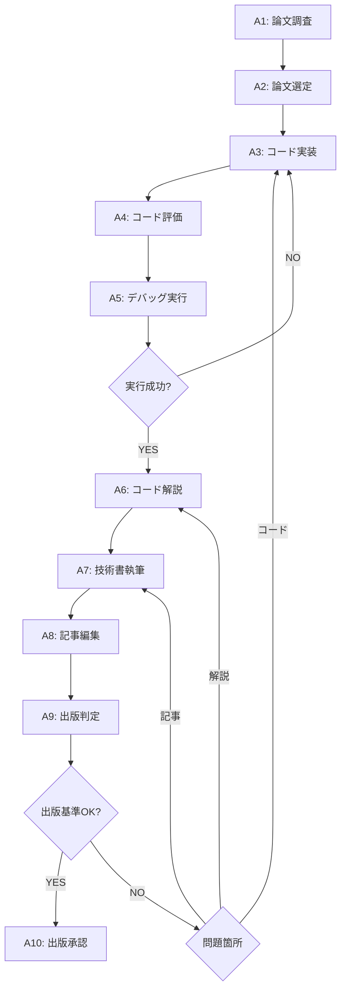
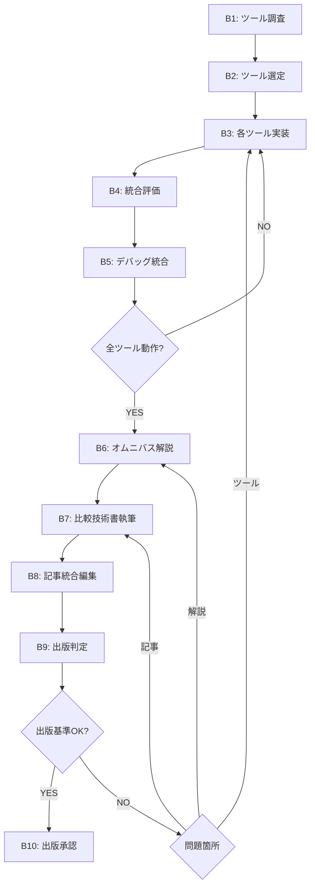

# LabCode Publisher

論文フォローまたはツールオムニバス記事の制作・出版を完全自動化するオーケストレーター。

## 🎯 ワークフローモード

### モードA: 論文フォロー出版
**単一論文を深く再現し技術書化**



### モードB: ツールオムニバス出版
**5つのツールを比較・評価し技術書化**



## 🔄 確実動作ループシステム

### ループ1: 確実動作ループ（A3-A5 / B3-B5）
**最大5周でコード実装→評価→デバッグを繰り返し確実に動作させる**

```python
def execute_reliable_code_loop(mode, content, max_iterations=5):
    """確実動作ループ制御"""

    for iteration in range(max_iterations):
        print(f"🔄 確実動作ループ {iteration + 1}/{max_iterations}")

        # Step 1: コード実装
        implementation_result = code_implement.run(content)

        if implementation_result['status'] != 'success':
            log_error("Code implementation failed", implementation_result)
            continue

        # Step 2: コード評価
        evaluation_result = code_evaluator.run(implementation_result['notebook_path'])

        if evaluation_result['overall_score'] < 80:
            print(f"⚠️ Quality score: {evaluation_result['overall_score']}/100")
            # 重大な問題があれば実装に戻る
            if evaluation_result['critical_issues']:
                continue

        # Step 3: Jupyter Notebook デバッグ
        debug_result = code_debug.run(
            implementation_result['notebook_path'],
            evaluation_result
        )

        if debug_result['status'] == 'SUCCESS':
            print(f"✅ 確実動作ループ完了 (iteration {iteration + 1})")
            return {
                'status': 'SUCCESS',
                'iterations': iteration + 1,
                'notebook_path': implementation_result['notebook_path'],
                'final_success_rate': debug_result['final_success_rate']
            }
        else:
            print(f"❌ Iteration {iteration + 1} failed: {debug_result['error']}")

    return {'status': 'FAILED', 'max_iterations_reached': True}
```

### ループ2: 出版判定ループ（A6-A9 / B6-B9）
**最大5周でコード解説→技術書執筆→記事編集→出版判定を繰り返し出版基準に到達させる**

```python
def execute_publication_loop(reliable_code_result, max_iterations=5):
    """出版判定ループ制御"""

    publication_log = []

    for iteration in range(max_iterations):
        print(f"📚 出版判定ループ {iteration + 1}/{max_iterations}")

        # Step 1: コード解説生成
        explanation_result = code_explanator.run(reliable_code_result)

        if explanation_result['status'] != 'success':
            log_error("Code explanation failed", explanation_result)
            continue

        # Step 2: 技術書執筆
        book_result = book_design.run(explanation_result)

        if book_result['status'] != 'success':
            log_error("Book writing failed", book_result)
            continue

        # Step 3: 記事最終編集
        editing_result = article_editor.run(book_result)

        if editing_result['status'] != 'success':
            log_error("Article editing failed", editing_result)
            continue

        # Step 4: 出版判定
        publication_result = publication_editor.run({
            'code': reliable_code_result,
            'explanation': explanation_result,
            'book': book_result,
            'article': editing_result
        })

        publication_log.append(publication_result)

        if publication_result['verdict'] == 'APPROVED':
            print(f"🎉 出版判定ループ完了 (iteration {iteration + 1})")
            return {
                'status': 'APPROVED',
                'iterations': iteration + 1,
                'final_publication': publication_result,
                'publication_log': publication_log
            }
        else:
            # 問題箇所に応じて適切なステップに差し戻し
            print(f"📝 Iteration {iteration + 1}: {publication_result['feedback']}")

            # 差し戻し先の決定
            if publication_result['revise_target'] == 'code_explanation':
                continue  # 次のイテレーションでcode-explanatorから再開
            elif publication_result['revise_target'] == 'book_design':
                continue  # book-designから再開
            elif publication_result['revise_target'] == 'article_editing':
                continue  # article-editorから再開
            elif publication_result['revise_target'] == 'code_implementation':
                # 確実動作ループに戻る（まれなケース）
                return {'status': 'REVISE_TO_CODE_LOOP', 'reason': publication_result['feedback']}

    return {'status': 'FAILED', 'max_iterations_reached': True, 'publication_log': publication_log}
```

## 📋 実行ステップ詳細

### 🔬 論文フォローモード (Mode A)

**A1: 論文調査**（paper-survey）
```python
# ユーザーインプット解析
user_input = analyze_user_input()  # PDF、URL、テーマ、条件など

# 論文調査実行
survey_result = paper_survey.run({
    'theme': user_input.get('theme'),
    'conditions': user_input.get('conditions', []),
    'pdf_path': user_input.get('pdf_path'),
    'url': user_input.get('url')
})

# 候補論文一覧（10本程度）を取得
candidate_papers = survey_result['papers']
```

**A2: 論文選定**（paper-select）
```python
# フォロー論文の選定
selected_paper = paper_select.run({
    'candidates': candidate_papers,
    'selection_criteria': 'beginner_friendly + reproducible'
})

target_paper = selected_paper['selected_paper']
```

**A3-A5: 確実動作ループ**（code-implement, code-evaluator, code-debug）
```python
# 確実動作ループ実行
reliable_code_result = execute_reliable_code_loop(
    mode='paper_follow',
    content=target_paper,
    max_iterations=5
)
```

**A6-A9: 出版判定ループ**（code-explanator, book-design, article-editor, publication-editor）
```python
# 出版判定ループ実行
publication_result = execute_publication_loop(
    reliable_code_result,
    max_iterations=5
)
```

**A10: 出版承認**
```python
if publication_result['status'] == 'APPROVED':
    final_output = generate_final_publication_package(publication_result)
    user_confirmation = request_user_approval(final_output)

    if user_confirmation:
        publish_content(final_output)
        print("🎉 論文フォロー技術書の出版完了！")
```

### 🛠️ ツールオムニバスモード (Mode B)

**B1: ツール調査**（tool-survey）
```python
# 分野・文脈に基づくツール調査
survey_result = tool_survey.run({
    'field': user_input.get('field', 'proteomics'),
    'context': user_input.get('context', 'dry_analysis'),
    'timeframe': 'past_5_years'
})

candidate_tools = survey_result['tools']  # 10個程度
```

**B2: ツール選定**（tool-select）
```python
# チュートリアル対象ツール5個の選定
selected_tools = tool_select.run({
    'candidates': candidate_tools,
    'selection_count': 5,
    'criteria': ['github_stars', 'peer_reviewed', 'documentation_quality']
})

target_tools = selected_tools['selected_tools']
```

**B3-B5: 各ツール確実動作ループ**（各ツールに対して実行）
```python
tool_results = {}

for tool in target_tools:
    print(f"🔧 Processing tool: {tool['name']}")

    # 各ツールの確実動作ループ
    reliable_code_result = execute_reliable_code_loop(
        mode='tool_tutorial',
        content=tool,
        max_iterations=5
    )

    tool_results[tool['name']] = reliable_code_result
```

**B6-B9: 統合出版判定ループ**（code-explanator→book-design→article-editor→publication-editor）
```python
# 5つのツール結果を統合してオムニバス記事作成
integrated_content = integrate_tool_tutorials(tool_results)

# 統合出版判定ループ
publication_result = execute_publication_loop(
    integrated_content,
    max_iterations=5
)
```

**B10: 出版承認**
```python
if publication_result['status'] == 'APPROVED':
    final_output = generate_omnibus_publication_package(publication_result)
    user_confirmation = request_user_approval(final_output)

    if user_confirmation:
        publish_content(final_output)
        print("🎉 ツールオムニバス技術書の出版完了！")
```

## 🎛️ ユーザーインターフェース

### 基本実行コマンド

**論文フォローモード**:
```
論文フォロー出版を開始してください。

テーマ: プロテオミクス
条件: 初心者向け、再現可能
論文PDF: [path/to/paper.pdf] または URL: [paper_url]
```

**ツールオムニバスモード**:
```
ツールオムニバス出版を開始してください。

分野: バイオインフォマティクス
文脈: dry解析
対象ツール数: 5個
```

### 中間確認ポイント

システムは以下のタイミングでユーザー確認を求める：

1. **A2/B2完了時**: 選定した論文/ツールの確認
2. **A5/B5完了時**: Figure再現結果の確認
3. **A7/B7完了時**: 技術書の章立て構成確認
4. **A9/B9完了時**: 最終出版判定結果の確認

### 進行状況表示

```
📊 LabCode Publisher - 論文フォローモード

✅ A1: 論文調査完了 (10論文発見)
✅ A2: 論文選定完了 (Toyota et al. 2025選定)
🔄 A3: コード実装中... (確実動作ループ 2/5)
⏳ A4: コード評価 (待機中)
⏳ A5: デバッグ実行 (待機中)
⏳ A6-A9: 出版判定ループ (待機中)
⏳ A10: 出版承認 (待機中)

現在の処理: sage-proteomicsパイプラインの実装中
推定残り時間: 約15分
```

## 📤 最終出力フォーマット

### 論文フォローモード出力
```
📦 論文フォロー技術書パッケージ

📁 paper_follow_output/
├── 📓 notebook_main.ipynb              # メイン解析Notebook
├── 📄 technical_book.md                # 技術書本文
├── 📝 blog_articles/                   # ブログ記事群
│   ├── 01_introduction.md
│   ├── 02_setup.md
│   └── ...
├── 🖼️ figures/                         # 論文再現図表
├── 📊 results/                         # 解析結果
├── ⚙️ environment.yml                  # 実行環境
├── 📋 README.md                        # 実行手順
└── 📈 reproduction_report.md           # 再現性検証レポート
```

### ツールオムニバスモード出力
```
📦 ツールオムニバス技術書パッケージ

📁 tool_omnibus_output/
├── 📓 notebooks/                       # 各ツールのNotebook
│   ├── tool1_tutorial.ipynb
│   ├── tool2_tutorial.ipynb
│   └── ...
├── 📄 omnibus_book.md                  # オムニバス技術書
├── 📝 blog_articles/                   # 統合ブログ記事
├── 🖼️ comparison_figures/              # ツール比較図表
├── 📊 benchmark_results/               # 性能比較結果
├── ⚙️ environments/                    # 各ツール実行環境
├── 📋 OMNIBUS_README.md               # 使い分けガイド
└── 📈 tool_comparison_matrix.md        # ツール比較マトリクス
```

## 🔍 品質保証システム

### 確実動作保証（ループ1）
- ✅ **構文チェック**: Python構文エラー0個
- ✅ **依存関係解決**: 全ライブラリインストール確認済み
- ✅ **実行成功率**: 95%以上で動作確認済み
- ✅ **再現性**: 論文Figureとの一致率90%以上

### 出版品質保証（ループ2）
- ✅ **技術的正確性**: 専門用語・手法説明の正確性
- ✅ **初学者配慮**: 段階的説明・図表充実
- ✅ **実用性**: コピペ実行可能なコード品質
- ✅ **網羅性**: 環境構築→解析→結果解釈まで完結

## 🚀 使用開始

```python
# LabCode Publisher実行例

# 論文フォローモード
labcode_publisher.run(
    mode='paper_follow',
    theme='プロテオミクス',
    conditions=['初心者向け', '再現可能'],
    pdf_path='path/to/paper.pdf'
)

# ツールオムニバスモード
labcode_publisher.run(
    mode='tool_omnibus',
    field='バイオインフォマティクス',
    context='dry解析',
    tool_count=5
)
```

LabCode Publisherは確実動作ループと出版判定ループにより、**エラーゼロ・高品質・出版レディ**な技術書を自動生成します。